<div align="center">
  <p>⚠️🏗️🚧🦺🧱🪵🪨🪚🛠️👷</p>
  <i>This is a working draft in progress.</i>
  <br/>
  
  <br/>
  <blockquote>
	  <em>The scene is from the series <b>Mr. Robot</b>
    <br/>
    <a href="https://www.usanetwork.com/mr-robot">Mr. Robot Official Site</a></em>
	  <br/>
	  <i>gif image is provided by <a href="https://giphy.com">Giphy</a></i>
    <br/>
  </blockquote>
  <p>⚠️🏗️🚧🦺🧱🪵🪨🪚🛠️👷</p>

</div>


# North Korea-linked Supply Chain Attack Targets Developers with 35 Malicious npm Packages
<details open>
<summary>Click to show/hide the full disclaimer.</summary>
   
> <ins>📢 **Disclaimer** 🚨</ins>
>
> This document contains my personal notes on the topic,
> compiled from publicly available documentation and various cited sources.
> The materials are intended for 👨‍🎓 <ins>educational purposes</ins> 👨‍🎓 (<ins>:trollface:sometimes, entertainment purposes:trollface:</ins>), 📖 <ins> personal study </ins> 📖, and 🔖 <ins> reference </ins> 🔖.
> The content is dual-licensed:
> 1. **MIT License:** Applies to all code implementations (Swift, Mermaid, and other programming languages).
> 2. **Creative Commons Attribution-ShareAlike 4.0 International License (CC BY-SA 4.0):** Applies to all non-code content, including text, explanations, diagrams, and illustrations.

</details>


---


Cybersecurity researchers have sounded the alarm 🔔 on a fresh wave of malicious activity linked to North Korean state-sponsored threat actors. This campaign, dubbed "Contagious Interview," showcases an evolving and sophisticated approach to targeting software developers for financial gain and data theft. This document breaks down the key aspects of this campaign, using diagrams to illustrate its mechanics and complexity.

----

## 🎣 The "Contagious Interview" Campaign: An Overview

The "Contagious Interview" operation is an ongoing effort by North Korean hackers to infiltrate developer systems. Their primary goals include stealing cryptocurrency 💰 and sensitive data. The campaign uniquely blends supply chain attacks with clever social engineering tactics.

Here's a bird's-eye view of the campaign:

```mermaid
---
title: "The Contagious Interview Campaign: An Overview"
author: "Cong Le"
version: "1.0"
license(s): "MIT, CC BY-SA 4.0"
copyright: "Copyright (c) 2025 Cong Le. All Rights Reserved."
config:
  theme: base
---
%%%%%%%% Mermaid version v11.4.1-b.14
%%{
  init: {
    'fontFamily': 'American Typewriter, monospace',
    'logLevel': 'fatal',
    'mindmap': {
	    'nodeAlign': 'center',
	    'padding': 20
    },
    'themeVariables': {
      'primaryColor': '#FC82',
      'primaryTextColor': '#F8B229',
      'primaryBorderColor': '#27AE60',
      'secondaryColor': '#EBF3',
      'secondaryTextColor': '#6C3483',
      'secondaryBorderColor': '#A569BD',
      'fontSize': '20px'
    }
  }
}%%
mindmap
  root)"**Contagious Interview Campaign** 🎣"(
    Actor))"**Actor**:<br/>**North Korean State-Sponsored Actors** 🇰🇵"((
    Primary_Objective))"**Primary Objective**:<br/>**Financial Gain & Espionage** 💰🕵️"((
    Sub_Objective{{"Sub Objectives"}}
	    Sub_Objective1("Cryptocurrency Theft")
	    Sub_Objective2("Sensitive Data Theft")
	    Sub_Objective3("Unauthorized System Access")
    Targets))"Targets:<br/>Software Developers 💻"((
	    Detail["Especially those actively job-hunting"]
    Primary_Methods))"**Primary Methods**:<br/>**Multi-faceted Attack**"((
      Method1{{"Supply Chain Attack via npm 📦"}}
        Detail1[Malicious Packages]
      Method2{{"Social Engineering 🎭"}}
        Detail2[Fake Recruiter Personas]
        Detail3[Bogus Coding Assignments]
    Known_Aliases))"**Known Aliases**"((
      Alias1{{"CL-STA-0240"}}
      Alias2{{"DeceptiveDevelopment"}}
      Alias3{{"DEV#POPPER"}}
      Alias4{{"Famous Chollima"}}
      Alias5{{"Gwisin Gang"}}
      Alias6{{"Tenacious Pungsan"}}
      Alias7{{"UNC5342"}}
      Alias8{{"Void Dokkaebi"}}
    Related_SubCampaigns))"**Related Sub-Campaigns**"((
      SubCampaign1{{"ClickFake Interview"}}
        Source["[ClickFake Interview](https://thehackernews.com/2025/06/bluenoroff-deepfake-zoom-scam-hits.html)"]
        Tactic["Tactic:<br/>ClickFix Social Engineering"]
        Malware["Malware:<br/>GolangGhost, PylangGhost"]
```



This campaign is also known by several other monikers, reflecting its widespread tracking by cybersecurity firms. Recent iterations have seen the attackers leveraging tactics like "ClickFix" social engineering in a sub-cluster named "ClickFake Interview," deploying malware such as GolangGhost and PylangGhost.

----

## 📦 Malicious npm Packages: The Initial Foothold

A key vector for this campaign is the use of malicious npm packages. The attackers upload these packages, often mimicking legitimate tools or adding seemingly useful functionalities, to the npm registry.

**Key Statistics:**

*   **Total Malicious Packages Identified:** 35
*   **npm Accounts Used:** 24
*   **Collective Downloads:** Over 4,000
*   **Packages Still Available (at time of Socket's report):** 6

_Let $N_P$ be the total number of malicious npm packages identified._
$N_P = 35$

_Let $N_A$ be the number of npm accounts used for uploading._
$N_A = 24$

_Let $N_D$ be the total number of collective downloads._
$N_D > 4000$

_Let $N_{SA}$ be the number of packages that remained available for download at the time of the report._
$N_{SA} = 6$

The list of all 35 packages is provided in the original [Socket report](https://socket.dev/blog/north-korean-contagious-interview-campaign-drops-35-new-malicious-npm-packages) and includes names like `react-plaid-sdk`, `sumsub-node-websdk`, and `vite-plugin-next-refresh`.

```mermaid
---
title: "📦 Malicious npm Packages: The Initial Foothold"
author: "Cong Le"
version: "1.0"
license(s): "MIT, CC BY-SA 4.0"
copyright: "Copyright (c) 2025 Cong Le. All Rights Reserved."
config:
  layout: elk
  theme: base
  look: handDrawn
---
%%%%%%%% Mermaid version v11.4.1-b.14
%%%%%%%% Available curve styles include the following keywords:
%% basis, bumpX, bumpY, cardinal, catmullRom, linear, monotoneX, monotoneY, natural, step, stepAfter, stepBefore.
%%{
  init: {
    'flowchart': { 'htmlLabels': true, 'curve': 'basis' },
    'fontFamily': 'American Typewriter, monospace',
    'logLevel': 'fatal',
    'themeVariables': {
      'primaryColor': '#22BB',
      'primaryTextColor': '#F8B229',
      'lineColor': '#F8B229',
      'primaryBorderColor': '#27AE60',
      'secondaryColor': '#E2F1',
      'secondaryTextColor': '#6C3483',
      'secondaryBorderColor': '#A569BD',
      'fontSize': '20px'
    }
  }
}%%
flowchart TD
    A["<div style='text-align:center'>Threat Actors Leverage<br><span style='font-size:1.5em; font-weight:bold;'>24</span><br>npm Accounts 🎭</div>"] --> B["<div style='text-align:center'>Upload<br><span style='font-size:1.5em; font-weight:bold;'>35</span><br>Malicious npm Packages 📦</div>"]
    B --> C["<div style='text-align:center'>Packages achieve over<br><span style='font-size:1.5em; font-weight:bold;'>4,000</span><br>Collective Downloads 📈</div>"];
    C --> D["<div style='text-align:center'><span style='color:red; font-size:1.5em; font-weight:bold;'>6</span><br>Packages Remained Available<br>at time of Reporting 🚨</div>"]

    subgraph Example_Packages["Example Packages<br/>(Not Exhaustive)"]
    style Example_Packages fill:#F2F2,stroke:#333,stroke-width:1px, color: #FFFF
        P1["<b>react-plaid-sdk</b>"]
        P2["<b>sumsub-node-websdk</b>"]
        P3["<b>vite-plugin-next-refresh</b>"]
        P4["<b>node-loggers</b>"]
        P5["<b>lucide-node</b>"]
        P6["<b>router-parse</b>"]
    end
    
    D --> P1
    D --> P2
    D --> P3
    D --> P4
    D --> P5
    D --> P6

    X["Full list of packages available in the <a href='https://socket.dev/blog/north-korean-contagious-interview-campaign-drops-35-new-malicious-npm-packages'>Socket report and article</a>."]
    C --> X

    classDef stats fill:#eff2,stroke:#333,stroke-width:1px,padding:10px,rounded-corners:5px;
    class A,B,C,D stats;
    classDef examplePackage fill:#f2B3,stroke:red,stroke-width:1px,padding:5px;
    class P1,P2,P3,P4,P5,P6 examplePackage
```



---

## 🪆 The Malware "Nesting Doll": A Multi-Stage Attack

Each malicious npm package employs a "nesting-doll" structure to deliver its final payload, helping to evade basic detection methods.

**The Delivery Chain:**

1.  **HexEval Loader:** Embedded within the npm package, this hex-encoded loader collects host information upon installation. It then selectively delivers the next stage.
2.  **BeaverTail Stealer:** A known JavaScript stealer, delivered by HexEval. Its main role here is to download and execute the subsequent backdoor. ([More on BeaverTail](https://thehackernews.com/2025/04/north-korean-hackers-deploy-beavertail.html))
3.  **InvisibleFerret Backdoor:** A Python backdoor delivered by BeaverTail. This grants the attackers remote control over the infected host and allows them to exfiltrate sensitive data.
4.  **(Optional) Keylogger:** Some npm aliases also deployed a cross-platform keylogger 🔑, indicating the attackers' readiness to escalate surveillance on high-value targets.

This multi-stage approach can be visualized as:

```mermaid
---
title: "🪆 The Malware 'Nesting Doll': A Multi-Stage Attack"
author: "Cong Le"
version: "1.0"
license(s): "MIT, CC BY-SA 4.0"
copyright: "Copyright (c) 2025 Cong Le. All Rights Reserved."
config:
  layout: elk
  theme: base
  look: handDrawn
---
%%%%%%%% Mermaid version v11.4.1-b.14
%%%%%%%% Available curve styles include the following keywords:
%% basis, bumpX, bumpY, cardinal, catmullRom, linear, monotoneX, monotoneY, natural, step, stepAfter, stepBefore.
%%{
  init: {
    'flowchart': { 'htmlLabels': true, 'curve': 'basis' },
    'fontFamily': 'American Typewriter, monospace',
    'logLevel': 'fatal',
    'themeVariables': {
      'primaryColor': '#22BB',
      'primaryTextColor': '#F8B229',
      'lineColor': '#F8B229',
      'primaryBorderColor': '#27AE60',
      'secondaryColor': '#E2F1',
      'secondaryTextColor': '#6C3483',
      'secondaryBorderColor': '#A569BD',
      'fontSize': '20px'
    }
  }
}%%
flowchart TD
    subgraph Infection_Stages_on_Victim_Machine["Infection Stages on Victim's Machine 💻"]
    style Infection_Stages_on_Victim_Machine fill:#F2F2,stroke:#333,stroke-width:1px, color: #FFFF
        A["<b>Stage 1:</b><br/>Installation of<br>Malicious npm Package 🚫📦"] -- "contains" --> B("<b>HexEval Loader</b><br><small>Hex-encoded, Collects Host Info</small>")
        B -- "Selectively Delivers" --> C("<b>Stage 2:<br/> BeaverTail Stealer</b><br><small>JavaScript-based, Fetches Next Payload</small>")
        C -- "Downloads & Executes" --> D("<b>Stage 3:<br/> InvisibleFerret Backdoor</b><br><small>Python-based, Data Exfil & Remote Control</small>")
        D --> E["Outcome:<br/>Sensitive Data Theft 🕵️💰<br>Remote System Control 🕹️"]

        F["<b>Optional Stage:</b><br/>Cross-Platform Keylogger 🔑<br><small>Via specific npm alias</small>"] --> G["Outcome:<br/>Keystroke Capture<br><small>(Deeper Surveillance)</small>"]
    end

    H["Evasion Tactic:<br/>Nesting-doll structure helps bypass<br>basic static scanners & manual review 🛡️"]

    style A fill:#FA29,stroke:#A52A2A,stroke-width:2px
    style B fill:#F2CB,stroke:#A52A2A,stroke-width:2px
    style C fill:#AD86,stroke:#00008B,stroke-width:2px
    style D fill:#9E92,stroke:#006400,stroke-width:2px
    style E fill:#F22D,stroke:#BDB76B,stroke-width:1px
    style F fill:#D23D3,stroke:#696969,stroke-width:2px
    style G fill:#BBD2,stroke:#BDB76B,stroke-width:1px
    style H fill:#D2BB,stroke:#48D1CC,stroke-width:1px,textColor:black
```



_Conceptual Malware Progression:_

$$
\text{npm Package} \xrightarrow{\text{contains}} \text{HexEval} \xrightarrow{\text{delivers}} \text{BeaverTail} \xrightarrow{\text{delivers}} \text{InvisibleFerret}
$$

---

## 🎭 Social Engineering: Exploiting Trust

The technical aspect of the malware is coupled with sophisticated social engineering. Attackers pose as recruiters, primarily on LinkedIn, to lure job-seeking developers.

**The Social Engineering Playbook:**

1.  **Impersonation:** Attackers create convincing fake recruiter personas.
2.  **Outreach:** They contact developers with scripted messages and appealing job descriptions. ([Reddit discussion on tactics](https://www.reddit.com/r/CryptoScams/comments/1k37az4/exposing_north_korean_scamming_tactics_and_some/), [Developer experience](https://www.reddit.com/r/programming/comments/1i84akt/recruiter_tried_to_hack_me_full_story_on_comments/))
3.  **The Bait:** Developers are given "coding assignments" by sharing links to malicious projects hosted on platforms like GitHub or Bitbucket. These projects embed the malicious npm packages.
4.  **Execution:** Victims are then persuaded to clone and run these projects locally, often outside containerized environments, during a purported interview process.

```mermaid
---
title: "🎭 The Social Engineering Playbook 🎭"
author: "Cong Le"
version: "1.0"
license(s): "MIT, CC BY-SA 4.0"
copyright: "Copyright (c) 2025 Cong Le. All Rights Reserved."
config:
  layout: elk
  theme: base
  look: handDrawn
---
%%%%%%%% Mermaid version v11.4.1-b.14
%%%%%%%% Available curve styles include the following keywords:
%% basis, bumpX, bumpY, cardinal, catmullRom, linear, monotoneX, monotoneY, natural, step, stepAfter, stepBefore.
%%{
  init: {
    'flowchart': { 'htmlLabels': true, 'curve': 'basis' },
    'fontFamily': 'American Typewriter, monospace',
    'logLevel': 'fatal',
    'themeVariables': {
      'primaryColor': '#22BB',
      'primaryTextColor': '#F8B229',
      'lineColor': '#F8B229',
      'primaryBorderColor': '#27AE60',
      'secondaryColor': '#E2F1',
      'secondaryTextColor': '#6C3483',
      'secondaryBorderColor': '#A569BD',
      'fontSize': '20px'
    }
  }
}%%
flowchart LR
    subgraph Attacker_Actions["Attacker Actions 🎭 <br/>(Leveraging OSINT)"]
    style Attacker_Actions fill:#F2F2,stroke:#333,stroke-width:1px, color: #FFFF
        A["Attacker Creates Fake<br>Recruiter Persona on LinkedIn"] --> B("Identifies & Contacts<br>Job-Seeking Developer 🎯")
        B -- "Shares 'Coding Assignment'" --> C("Link to Malicious Project<br>on GitHub/Bitbucket 🔗")
        C -- "Project embeds<br>malicious npm packages" --> D["Attacker Waits for Execution"]
    end

    subgraph Victim_Journey_and_Potential_Compromise["Victim's Journey & Potential Compromise 👨‍💻"]
    style Victim_Journey_and_Potential_Compromise fill:#22F2,stroke:#333,stroke-width:1px, color: #FFFF
        B --> V1["Developer Receives 'Opportunity'"]
        V1 -- "During 'Interview Process'" --> V2{"Trusts & Decides to Run Project?"}
        V2 -- "Yes, clones & runs project<br/>(potentially outside container)" --> V3["Malicious npm Package Installation<br>& Payload Execution"]
        V3 --> V4["System Compromise! 🚨"]
        V2 -- "No, or runs in isolated<br>sandboxed environment" --> V5["Attack May Fail or be Limited 👍"]
    end

    style A fill:#0000CD,stroke:#B0E0E6
    style B fill:#C71585,stroke:#FFB6C1
    style C fill:#8A2BE2,stroke:#DDA0DD
    style V1 fill:#B60B,stroke:#F0E68C
    style V2 fill:#2BE2 ,stroke:#FFE4B5
    style V3 fill:#8B0000,stroke:#FF6347
    style V4 fill:#8B0000,stroke:#DC143C,font-weight:bold
    style V5 fill:#006400,stroke:#98FB98,font-weight:bold
```



---

## 🛠️ Attacker Tradecraft: A Sophisticated Adversary

This campaign is not a simple smash-and-grab. It highlights the refined and evolving tradecraft of North Korean threat actors. Socket researchers emphasize several key characteristics:

```dot
/*
 * title: Attacker Tradecraft: A Sophisticated Adversary
 * author: Cong Le
 * version: 1.0
 * license(s): MIT, CC BY-SA 4.0
 * copyright: Copyright (c) 2025 Cong Le. All Rights Reserved.
 */
digraph AttackerTradecraft {
    rankdir=TB
    graph [bgcolor=transparent, fontname="Helvetica", fontsize=12, label="North Korean Attacker Tradecraft & Sophistication ✨", labelloc=t]
    node [shape=box, style="filled,rounded", fillcolor="#FFF5E1", fontname="Helvetica", color="#FFA500", penwidth=1.5]
    edge [fontname="Helvetica", fontsize=10, color="#696969"]

    SocialEngineering [label="Social Engineering 🎭\n(Fake Recruiters, Bogus Interviews,\nExploiting Trust)"]
    OSINT [label="OSINT-Driven Targeting 🎯\n(Identifying Active Job Seekers)"]
    SupplyChain [label="Supply Chain Attacks 📦\n(Malicious npm Packages)"]
    MalwareStaging [label="Multi-Stage Malware Delivery 🪆\n(HexEval → BeaverTail → InvisibleFerret)"]
    Evasion [label="Evasion Techniques 🛡️\n(Hex Encoding, Minimal Registry Footprint,\nAnti-Container Attempts)"]
    OpenSourceAbuse [label="Open Source Ecosystem Abuse 🌐\n(Leveraging npm, GitHub, Bitbucket)"]
    RealTimeRefinement [label="Real-Time Method Refinement 🔄\n(Adapting & Improving Tactics)"]
    WellResourced [label="Well-Resourced Adversary 💸\n(Sustained & Complex Operations)"]

    // Relationships
    WellResourced -> SocialEngineering
    WellResourced -> SupplyChain
    WellResourced -> MalwareStaging
    WellResourced -> Evasion
    WellResourced -> RealTimeRefinement
    WellResourced -> OSINT
    WellResourced -> OpenSourceAbuse

    OSINT -> SocialEngineering [label="informs"]
    SocialEngineering -> SupplyChain [label="delivers"]
    SupplyChain -> MalwareStaging [label="initiates"]
    MalwareStaging -> Evasion [label="employs"]
    SupplyChain -> OpenSourceAbuse [label="exploits"]
    Evasion -> RealTimeRefinement [label="drives"]

    // Grouping related concepts (visually, if possible in final render)
    subgraph cluster_InitialAccess {
        label = "Initial Access & Delivery"
        style=filled
        color="#FFE0B2"
        node[style="filled,rounded", fillcolor="#FFF0DB"]
        SocialEngineering
        OSINT
        SupplyChain
        OpenSourceAbuse
    }

    subgraph cluster_PayloadAndEvasion {
        label = "Payload & Evasion"
        style=filled
        color="#FFCCBC"
        node[style="filled,rounded", fillcolor="#FFEBE6"]
        MalwareStaging; Evasion
    }
}
```



**Key Takeaways on Tradecraft:**

*   **Blended Approach:** The campaign skillfully combines malware staging, OSINT-driven targeting, and social engineering.
*   **Stealth:** Embedding loaders like HexEval in open-source packages helps bypass perimeter defenses.
*   **Resilience:** The multi-stage structure and attempts to evade containerized environments point to a well-resourced adversary.
*   **Adaptability:** The attackers are refining their intrusion methods in real-time, learning and adapting to defenses.

----

## 🛡️ Conclusion: An Evolving Threat Landscape

The "Contagious Interview" campaign and its npm-based offshoots underscore the persistent and evolving threat posed by sophisticated state-sponsored actors. By targeting developers through trusted ecosystems and employing multi-layered deception, these attackers continue to find ways to breach defenses. This necessitates ongoing vigilance, robust security practices for developers, and awareness of such social engineering schemes.

----

> [!TIP]
> For further details, refer to the original article and the [Socket research](https://socket.dev/blog/north-korean-contagious-interview-campaign-drops-35-new-malicious-npm-packages).


-----


```mermaid
---
title: "❓...CongLeSolutionX....❓"
author: "Cong Le"
version: "1.0"
license(s): "MIT, CC BY-SA 4.0"
copyright: "Copyright (c) 2025 Cong Le. All Rights Reserved."
config:
  theme: base
---
%%%%%%%% Mermaid version v11.4.1-b.14
%%{
  init: {
    'flowchart': { 'htmlLabels': false },
    'fontFamily': 'Bradley Hand',
    'themeVariables': {
      'primaryColor': '#fc82',
      'primaryTextColor': '#F8B229',
      'primaryBorderColor': '#27AE60',
      'secondaryColor': '#559129',
      'secondaryTextColor': '#6C3483',
      'lineColor': '#F8B229',
      'fontSize': '20px'
    }
  }
}%%
flowchart LR
    My_Meme@{ img: "https://raw.githubusercontent.com/CongLeSolutionX/CongLeSolutionX/refs/heads/main/assets/images/My-meme-questions-magnifying-glass-tangled-lines-bubble-thought-flashlight.png", label: "Think<br/>before you type...", pos: "b", w: 200, h: 150, constraint: "off" }
   
    Link_to_my_profile{{"<a href='https://github.com/CongLeSolutionX' target='_blank'>Click here if you care about my profile</a>"}}

  Closing_quote@{ shape: braces, label: "Fellas,<br/>if you got some <ins>skills</ins>,<br/>please<br/>dont make <ins>hacker</ins> become a bad term<br/> in this era<br/>since<br/> my bots 🤖🤖🤖<br/>will eventually<br/>know<br/> who you are!"}
    
   Closing_quote ~~~ My_Meme
    
  Link_to_my_profile{{"<a href='https://github.com/CongLeSolutionX' target='_blank'>Click here if you care about my profile</a>"}}

  Closing_quote ~~~ My_Meme
  My_Meme animatingEdge@--> Link_to_my_profile
  
  animatingEdge@{ animate: true }

```

---
>**Licenses:**
>
>- **MIT License:**  [](LICENSE) - Full text in [LICENSE](LICENSE) file.
>- **Creative Commons Attribution-ShareAlike 4.0 International**: [CC BY-SA 4.0](https://creativecommons.org/licenses/by-sa/4.0/) [](https://creativecommons.org/licenses/by-sa/4.0/) - Legal details in [LICENSE-CC-BY-SA-4.0](THE_PAST/LICENSE-CC-BY-SA-4.0) and at [Creative Commons official site](https://creativecommons.org/licenses/by-sa/4.0/).
>
---