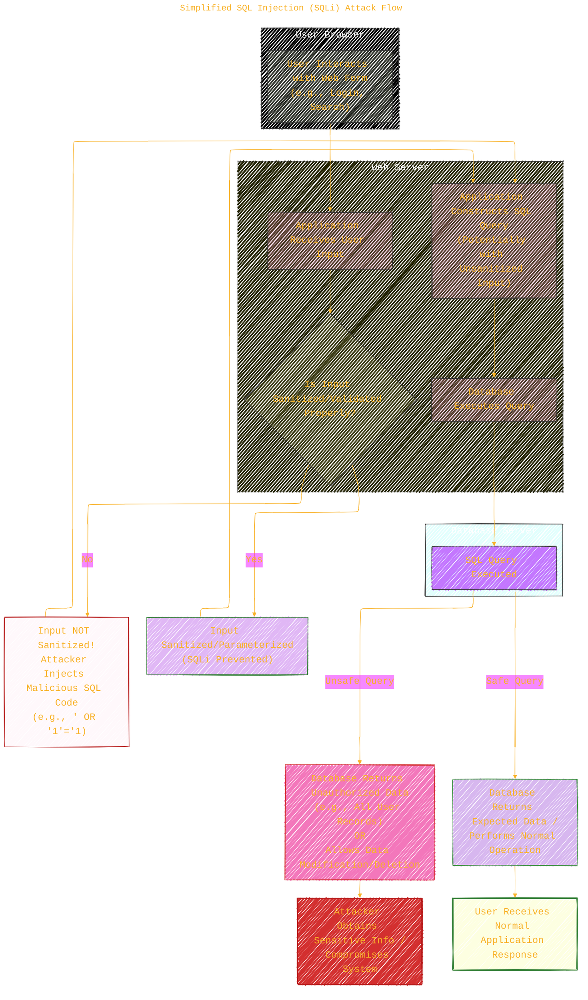

----

## **EthicaLumin**: <br/>*Illuminating The Realities of Hacking & Cybersecurity*

[](LICENSE) [](https://creativecommons.org/licenses/by-sa/4.0/) [](https://github.com/YourUsername/EthicaLumin/)

Copyright © 2025 Cong Le. All Rights Reserved.

----

> ⚠️🏗️🚧🦺🧱🪵🪨🪚🛠️👷
>
> This is a working draft in progress. Content is for educational (<ins>sometimes, entertaining </ins>) and informational purposes only.

<div align="center">
  <table style="border: none">
	<tr>
	  <td align="center", style="border: none">
		
		<br/>
		<em>The scene is from the series <b>Mr. Robot</b><br/><a href="https://www.usanetwork.com/mr-robot">Mr. Robot Official Site</a></em>
		<br/>
		<em>gif image is provided by <a href="https://giphy.com">Giphy</a></em>
	  </td>
	  <td align="center", border="none">
		<blockquote>
		  "Fellas,<br/>if you got some "skills",<br/>
		  please dont make "hacker"<br/>become a bad term in this era<br/>
		  since my bots will eventually know who you are!"
		</blockquote>
	  </td>
	</tr>
  </table>
</div>

```mermaid
---
title: "❓...CongLeSolutionX....❓"
author: "Cong Le"
version: "1.0"
license(s): "MIT, CC BY-SA 4.0"
copyright: "Copyright (c) 2025 Cong Le. All Rights Reserved."
config:
  theme: base
---
%%%%%%%% Mermaid version v11.4.1-b.14
%%{
  init: {
    'flowchart': { 'htmlLabels': false },
    'fontFamily': 'Bradley Hand',
    'themeVariables': {
      'primaryColor': '#fc82',
      'primaryTextColor': '#F8B229',
      'primaryBorderColor': '#27AE60',
      'secondaryColor': '#559129',
      'secondaryTextColor': '#6C3483',
      'lineColor': '#F8B229',
      'fontSize': '20px'
    }
  }
}%%
flowchart LR
    Coding_Meme@{ img: "https://raw.githubusercontent.com/CongLeSolutionX/CongLeSolutionX/refs/heads/main/assets/images/My-meme-questions-magnifying-glass-tangled-lines-bubble-thought-flashlight.png", label: "Exploring the Digital Maze...", pos: "b", w: 200, h: 150, constraint: "off" }
    %% Project_Link{{"<a href='https://github.com/CongLeSolutionX/EthicaLumin' target='_blank'>Discover EthicaLumin</a>"}}

    %% Coding_Meme animatingEdge@--> Project_Link
    %% animatingEdge@{ animate: true }

    %%My_Meme@{ img: "https://raw.githubusercontent.com/CongLeSolutionX/CongLeSolutionX/refs/heads/main/assets/images/My-meme-questions-magnifying-glass-tangled-lines-bubble-thought.png", label: "✍️...🤔❓🤔...👨🏼‍💻", pos: "b", w: 200, h: 150, constraint: "on" }
    Link_to_my_profile{{"<a href='https://github.com/CongLeSolutionX' target='_blank'>Click here if you care about my profile</a>"}}

  %%Closing_quote@{ shape: braces, label: "Fellas,<br/>if you got some <ins>skills</ins>,<br/>please<br/>dont make <ins>hacker</ins> become a bad term<br/> in this era<br/>since<br/> my bots 🤖🤖🤖<br/>will eventually<br/>know<br/> who you are!"}
    
   %%Closing_quote ~~~ Coding_Meme
    
  Link_to_my_profile{{"<a href='https://github.com/CongLeSolutionX' target='_blank'>Click here if you care about my profile</a>"}}

  %%Closing_quote ~~~ Coding_Meme
  Coding_Meme animatingEdge@--> Link_to_my_profile
  
  animatingEdge@{ animate: true }


```

-----

**Welcome to EthicaLumin!**

The world of "hacking" is often shrouded in mystery, sensationalism, and technical jargon, leading to widespread misconceptions and fear.

**EthicaLumin** is an open-source initiative dedicated to demystifying this complex domain by breaking down concepts, techniques, and ethical considerations into clear, concise, and interactive visual diagrams.

Using `Mermaid.js`, we create flowcharts, mind maps, sequence diagrams, and other visualizations to illustrate:

*   **Core Hacking Concepts:** Vulnerabilities, exploits, threat actors, attack surfaces.
*   **Types of Hacking:** Ethical hacking, penetration testing, red/blue/purple teaming, and their distinctions from malicious activities.
*   **Common Attack Vectors:** Phishing, malware, social engineering, web application vulnerabilities (SQLi, XSS), network attacks.
*   **Defensive Mechanisms & Strategies:** Firewalls, IDS/IPS, encryption, security best practices, incident response.
*   **Tools & Technologies:** Conceptual explanations of common cybersecurity tools and how they are used ethically and maliciously.
*   **Legal & Ethical Frameworks:** Responsible disclosure, bug bounties, relevant laws (e.g., CFAA), and ethical guidelines.
*   **Myth Busting:** Addressing and correcting common misunderstandings about hackers and cybersecurity.

Whether you are a student learning cybersecurity, a developer aiming to build secure applications, a professional seeking to understand threats, or simply a curious individual wanting to grasp the realities behind the headlines, `EthicaLumin` provides an accessible visual pathway.

**`EthicaLumin` is a sibling project to [AlgoVerse](https://github.com/CongLeSolutionX/AlgoVerse) (algorithms), [Synthetic Zooniverse](https://github.com/CongLeSolutionX/Synthetic-Zooniverse) (AI models), [ArchExplorer](https://github.com/CongLeSolutionX/ArchExplorer) (software architectures), and [LegalLens](https://github.com/CongLeSolutionX/LegalLens) (technology law). Together, these projects strive to enhance understanding of complex technical and regulatory domains through visualization.**

----

### Table of Contents

- [**EthicaLumin**: *Illuminating The Realities of Hacking \& Cybersecurity*](#ethicalumin-illuminating-the-realities-of-hacking--cybersecurity)
  - [Table of Contents](#table-of-contents)
  - [The Challenge \& Our Approach](#the-challenge--our-approach)
    - [A Personal Note: The Drive Behind EthicaLumin](#a-personal-note-the-drive-behind-ethicalumin)
    - [Our Method](#our-method)
  - [Hacking \& Cybersecurity Focus Areas](#hacking--cybersecurity-focus-areas)
  - [Repository Structure](#repository-structure)
  - [Example Visualization: Basic SQL Injection Flow](#example-visualization-basic-sql-injection-flow)
  - [Getting Started](#getting-started)
    - [Prerequisites](#prerequisites)
    - [Cloning the Repository (Optional)](#cloning-the-repository-optional)
  - [How to Use EthicaLumin](#how-to-use-ethicalumin)
  - [Contributing](#contributing)
- [🚀 Project Current Activities](#-project-current-activities)
  - [License](#license)
  - [**Crucial Disclaimer: Read Before Proceeding**](#crucial-disclaimer-read-before-proceeding)
  - [Markdown and Visualization Resources](#markdown-and-visualization-resources)

---

### The Challenge & Our Approach

<div align="center">
	
	<br/>
	<em>Misconceptions abound. gif image is provided by <a href="https://giphy.com">Giphy</a></em>
</div>

The public perception of hacking is heavily influenced by media portrayals that often prioritize drama over accuracy. This, combined with the inherently technical nature of cybersecurity, creates significant challenges:

*   **Sensationalism & Fear:** Leading to an oversized fear of "hackers" without understanding the nuances.
*   **Lack of Distinction:** Failure to differentiate between ethical hacking (security testing) and malicious attacks.
*   **Technical Complexity:** Making it difficult for non-experts to grasp fundamental concepts.
*   **Misinformation:** Spread of inaccurate information about vulnerabilities, exploits, and attacker motivations.
*   **Reactive Security Posture:** Often, focus shifts to security only after an incident, rather than proactive understanding and prevention.

-----

#### A Personal Note: The Drive Behind EthicaLumin

<div align="center">
	
	<br/>
	<em>Turning personal struggle into shared understanding and resolve. gif image is provided by <a href="https://giphy.com">Giphy</a></em>
</div>

The creation of `EthicaLumin` isn't just an academic exercise for me. For the past two years, I've personally been the target of persistent cybersecurity attacks and cyberbullying since the first releases of the Stable Diffusion models. It's been an incredibly challenging and distressing experience, leaving me feeling vulnerable, frustrated, and often helpless against unseen adversaries. I didn't understand what was happening, why it was happening, or how to adequately defend myself in this complex digital landscape.

This personal journey through the darker side of the internet ignited a fierce desire within me: to understand. To understand the tools, the tactics, and the mindsets involved. But this journey hasn't just been about passive learning; it's fueled a drive to develop my own capabilities for defense and to gain insights into those who operate in the shadows. It's a resolve that if lines are crossed, those responsible should understand that knowledge can also be a shield and a means of bringing clarity to their actions.

`EthicaLumin` is born from that struggle and that determination. It's my attempt to transform a negative experience into a positive, constructive resource for the wider community. By demystifying these topics, I hope to empower others who may feel similarly lost or intimidated by the world of cybersecurity. This project is about fostering understanding for the purpose of defense, awareness, and ethical conduct in the digital realm. While this repository offers educational content for all, my personal path continues to explore ways to actively identify and understand the sources of malicious activities, <u>sometimes based on real evidences and footprints attackers left on my digital accounts</u>, striving for a digital space where accountability is not just a concept but a reality.

The core aim of `EthicaLumin` remains to provide a visual interpretation layer, designed to help *everyone*:

*   **Gain Clarity:** Understand fundamental cybersecurity principles and hacking techniques through simplified visuals.
*   **Differentiate Motives & Methods:** Clearly see the differences between ethical security practices and malicious exploitation.
*   **Visualize Attack & Defense:** Map out common attack patterns and the corresponding defensive strategies.
*   **Learn Key Terminology:** Become familiar with essential vocabulary in the cybersecurity domain.
*   **Debunk Myths:** Identify and understand the truth behind common hacking misconceptions.
*   **Foster Ethical Understanding:** Emphasize the importance of responsible behavior and ethical considerations in cybersecurity.
*   **Support Learning & Awareness:** Provide accessible materials for individuals and organizations to improve their cybersecurity knowledge.

#### Our Method

<div align="center">
	
	<br/>
	<em>Shedding light on complexity. gif image is provided by <a href="https://giphy.com">Giphy</a></em>
</div>

1.  **Analyze Reputable Sources:** We review information from trusted cybersecurity organizations (e.g., [NIST](https://www.nist.gov/cybersecurity), [OWASP](https://owasp.org/), [SANS Institute](https://www.sans.org/)), academic research, and expert publications.
2.  **Create Mermaid Diagrams:** We select appropriate diagram types to best represent cybersecurity concepts, attack flows, defensive measures, or ethical considerations.
3.  **Provide Contextual Explanations:** Each diagram is accompanied by clear, concise text explaining the visualized elements, their significance, and the relationships depicted.
4.  **Link to Authoritative Resources:** Whenever possible, we link to original research, official guidelines, or reputable resources for deeper dives and verification.
5.  **Prioritize Clarity & Accuracy:** We aim for simplified, accurate representations, focusing on the essential elements for comprehension. *Note: These are interpretations and educational tools, not exhaustive guides or attack toolkits.*
6.  **Emphasize Ethical Implications:** We consistently highlight the ethical responsibilities associated with cybersecurity knowledge.
7.  **Foster Community Collaboration:** We actively encourage contributions to expand the scope and depth of visualized concepts.

**This project applies the visual learning principles established in AlgoVerse, Synthetic Zooniverse, ArchExplorer, and LegalLens to the critical domain of hacking and cybersecurity understanding.**

---

### Hacking & Cybersecurity Focus Areas

`EthicaLumin` aims to cover a broad spectrum of topics within hacking and cybersecurity. The mind map below provides an overview of the areas currently included or planned for visualization:

```mermaid
---
title: "EthicaLumin: Visualizing Hacking & Cybersecurity Domains"
author: "Cong Le"
version: "1.0"
license(s): "MIT, CC BY 4.0"
copyright: "Copyright (c) 2025 Cong Le. All Rights Reserved."
config:
  theme: base
---
%%%%%%%% Mermaid version v11.4.1-b.14 or compatible
%%{
  init: {
    'fontFamily': 'Verdana, sans-serif',
    'logLevel': 'fatal',
    'mindmap': {
	    'nodeAlign': 'center',
	    'padding': 20,
        'mirror': true
    },
    'themeVariables': {
      'primaryColor': '#007ACC',
      'primaryTextColor': '#FFFFFF',
      'primaryBorderColor': '#A4EF',
      'secondaryColor': '#E2EE',
      'secondaryTextColor': '#333',
      'secondaryBorderColor': '#C3D2',
      'fontSize': '16px'
    }
  }
}%%
mindmap
    root)"**Hacking & Cybersecurity**"(
        Core_Concepts))"**Core Concepts**"((
            Cybersecurity_Triad(Confidentiality, Integrity, Availability)
            Vulnerabilities(Definition, Types, Common Examples - e.g., CWE Top 25)
            Exploits(Definition, How they leverage vulnerabilities)
            Threat_Actors(Script Kiddies, Hacktivists, Organized Crime, Nation-States, Insiders)
            Attack_Surface(Definition, Mapping, Reduction)
            Risk_Management(Assessment, Mitigation, Acceptance, Transfer)
            Zero_Trust_Architecture(Principles, Implementation)
            Incident_Response(Preparation, Identification, Containment, Eradication, Recovery, Lessons Learned - NIST SP 800-61)
        Hacking_Spectrum))"**The Hacking Spectrum**"((
            Ethical_Hacking_White_Hat("Ethical Hacking (White Hat)")
                Penetration_Testing(Scope, Rules of Engagement, Phases: Recon, Scanning, Exploitation, Post-Exploitation, Reporting)
                Vulnerability_Assessment(Identifying weaknesses without exploitation)
                Security_Audits(Compliance checks, policy adherence)
            Malicious_Hacking_Black_Hat("Malicious Hacking (Black Hat)")
                Motivations(Financial gain, espionage, disruption, ideology)
                Common_Targets(Individuals, corporations, governments)
            Grey_Hat_Hacking("Grey Hat Hacking")
                Ambiguous_Legality_&_Ethics(Finding vulnerabilities without permission, sometimes disclosing publicly)
            Red_Team_vs_Blue_Team_vs_Purple_Team
                Red_Team(Simulates attacks)
                Blue_Team(Defends against attacks)
                Purple_Team(Facilitates communication & learning between Red/Blue)
        Common_Attack_Vectors))"**Common Attack Vectors**"((
            Social_Engineering
                Phishing_Spear_Phishing_Whaling("Deceptive emails, messages, calls - [Anti-Phishing Working Group (APWG)](https://apwg.org/)")
                Pretexting(Creating a fabricated scenario)
                Baiting(Offering a false reward)
                Tailgating/Piggybacking(Unauthorized physical access)
            Malware
                Viruses(Attach to programs)
                Worms(Self-replicating, spread across networks)
                Trojans(Disguised as legitimate software)
                Ransomware("Encrypts data, demands ransom - [NoMoreRansom Project](https://www.nomoreransom.org/)")
                Spyware_Adware(Monitors activity, displays unwanted ads)
                Rootkits(Conceal malicious presence)
            Web_Application_Attacks_OWASP_Top_10("Web Application Attacks (e.g., [OWASP Top 10](https://owasp.org/www-project-top-ten/))")
                SQL_Injection_SQLi(Injecting malicious SQL queries)
                Cross_Site_Scripting_XSS(Injecting malicious scripts into websites)
                Broken_Authentication_&_Session_Management
                Insecure_Deserialization
                Security_Misconfiguration
            Network_Attacks
                Denial_of_Service_DoS_DDoS(Overwhelming a system with traffic)
                Man_in_the_Middle_MitM(Intercepting communication)
                Sniffing(Capturing network traffic)
                Spoofing(IP, MAC, Email)
            Wireless_Attacks
                WPA_WEP_Cracking
                Rogue_Access_Points
                Evil_Twin_Attack
            Physical_Security_Breaches(Dumpster Diving, Shoulder Surfing)
        Defensive_Measures_&_Technologies))"**Defensive Measures & Technologies**"((
            Perimeter_Security
                Firewalls(Network, Web Application Firewalls - WAF)
                Intrusion_Detection_Systems_IDS_Intrusion_Prevention_Systems_IPS
                Demilitarized_Zone_DMZ
            Endpoint_Security
                Antivirus_Anti_malware_Software
                Endpoint_Detection_&_Response_EDR
                Host-based_Firewalls/IDS
            Data_Security
                Encryption_at_Rest_&_in_Transit(AES, TLS/SSL)
                Data_Loss_Prevention_DLP
                Backups_&_Recovery_Plans
            Identity_&_Access_Management_IAM
                Strong_Passwords_&_Passphrases
                Multi_Factor_Authentication_MFA
                Principle_of_Least_Privilege_PoLP
                Role_Based_Access_Control_RBAC
            Security_Monitoring_&_Logging
                Security_Information_&_Event_Management_SIEM
                Log_Analysis_&_Correlation
            Secure_Software_Development_Lifecycle_SSDLC
                Threat_Modeling
                Secure_Coding_Practices(Input Validation, Output Encoding)
                Static_Dynamic_Application_Security_Testing_SAST_DAST
        Tools_of_the_Trade_Conceptual))"**Tools of the Trade (Conceptual Overview)**"((
            Network_Scanners("Nmap - [Nmap Official Site](https://nmap.org/)")
            Vulnerability_Scanners(Nessus, OpenVAS)
            Exploitation_Frameworks("Metasploit Framework - [Metasploit Official Site](https://www.metasploit.com/)")
            Packet_Analyzers("Wireshark - [Wireshark Official Site](https://www.wireshark.org/)")
            Web_Proxies("Burp Suite, OWASP ZAP - [OWASP ZAP Project](https://www.zaproxy.org/)")
            Password_Crackers(John the Ripper, Hashcat)
            Operating_Systems_for_Security("Kali Linux, Parrot OS - [Kali Linux Official Site](https://www.kali.org/)")
        Legal_Ethical_&_Career_Aspects))"**Legal, Ethical & Career Aspects**"((
            Relevant_Laws_&_Regulations
                Computer_Fraud_and_Abuse_Act_CFAA_US
                GDPR_Data_Breach_Aspects_EU
                Local_Cybercrime_Laws
            Responsible_Disclosure_&_Bug_Bounties(Platforms like HackerOne, Bugcrowd)
            Ethical_Codes_of_Conduct(ISC_2_Code_of_Ethics, SANS Code of Ethics)
            Certifications_&_Careers("CISSP, CEH, OSCP, CompTIA Security+ - [CompTIA Security+](https://www.comptia.org/certifications/security)")
        Myth_Busting))"**Myth Busting**"((
            "All Hackers are Malicious Criminals"
            "Hacking is Always Illegal"
            "You Need to be a Genius to Hack"
            "Incognito Mode Makes You Anonymous"
            "Antivirus Makes You Invulnerable"
            "Macs/Linux are Immune to Viruses"

```



*This mind map serves as a guide to the topics covered. The repository structure reflects these categories. References to organizations like [NIST](https://www.nist.gov/cybersecurity), [OWASP](https://owasp.org/), and [SANS Institute](https://www.sans.org/) provide excellent starting points for deeper dives.*

---

### Repository Structure

The repository is logically organized by major cybersecurity domains, then further subdivided by specific concepts, techniques, or tools:

```plaintext
EthicaLumin/
├── LICENSE                 # MIT License (for code/diagram source)
├── LICENSE-CC-BY-SA-4.0    # CC BY-SA 4.0 License (for documentation/text)
├── README.md               # This overview file
│
├── CoreConcepts/
│   ├── CybersecurityTriad/
│   │   ├── README.md       # Explanation of Confidentiality, Integrity, Availability
│   │   └── diagrams/
│   │       └── cia_triad.mmd
│   ├── VulnerabilitiesExploits/
│   │   └── ...
│   └── ThreatActors/
│       └── ...
│
├── HackingSpectrum/
│   ├── EthicalHacking/
│   │   ├── README.md       # Overview of ethical hacking, pentesting
│   │   └── diagrams/
│   │       └── pentest_phases.mmd
│   ├── MaliciousHacking/
│   │   └── ...
│   └── RedBluePurpleTeaming/
│       └── ...
│
├── AttackVectors/
│   ├── SocialEngineering/
│   │   ├── Phishing/
│   │   │   ├── README.md
│   │   │   └── diagrams/
│   │   │       └── phishing_flow.mmd
│   │   └── ...
│   ├── Malware/
│   │   └── ...
│   ├── WebApplicationAttacks/
│   │   ├── SQLInjection/
│   │   │   └── ...
│   │   └── OWASP_Top_10_Overview/
│   └── NetworkAttacks/
│       └── ...
│
├── DefensiveMeasures/
│   ├── NetworkSecurity/
│   └── EndpointSecurity/
│   └── ...
│
├── ToolsExplained_Conceptual/  # Focus on WHAT they do, not HOW to use for attacks
│   ├── Nmap_Conceptual/
│   └── Metasploit_Conceptual/
│   └── ...
│
├── LegalEthicalAspects/
│   ├── ResponsibleDisclosure/
│   └── ...
│
└── MythBusting/
    ├── README.md
    └── diagrams/
        └── common_myths.mmd
```

Within each specific topic folder (e.g., `AttackVectors/SocialEngineering/Phishing/`):

*   **`README.md`:** Contains a detailed explanation of the concept, including its definition, how it works (at a high level), common examples, defensive considerations, and the Mermaid diagrams with corresponding textual breakdowns. Links to authoritative sources (e.g., [OWASP for SQLi](https://owasp.org/www-community/attacks/SQL_Injection)) are provided.
*   **`diagrams/`:** Holds the raw `Mermaid.js` source code (`.mmd` files) for the visualizations presented in the README.

We strive for consistency in structure and naming conventions across the repository, focusing on education and ethical understanding.

---

### Example Visualization: Basic SQL Injection Flow

This simplified flowchart illustrates the basic mechanism of an SQL Injection (SQLi) attack on a web application. SQL Injection is a common vulnerability listed in the [OWASP Top 10](https://owasp.org/www-project-top-ten/).



**Diagram Explanation:**

1.  **User Interaction:** A user submits data through a web form (e.g., a login field, search bar).
2.  **Application Receives Input:** The web server application takes this input.
3.  **Sanitization Check (Critical Point):**
	*   **Vulnerable Path (No/Poor Sanitization):** If the application does *not* properly sanitize or validate the user input, an attacker can insert malicious SQL code fragments. For example, inputting `' OR '1'='1` into a username field might alter the SQL query.
	*   **Secure Path (Proper Sanitization):** If the input is correctly sanitized (e.g., special characters escaped) or parameterized queries are used, the malicious SQL is treated as literal data, not executable code.
4.  **SQL Query Construction:** The application builds an SQL query to interact with the database, incorporating the user's input. If unsanitized, the malicious code becomes part of the query.
5.  **Database Executes Query:** The database server attempts to run the constructed query.
6.  **Outcome:**
	*   **Compromised (Unsafe Query):** If the query was manipulated by SQLi, the database might execute unintended commands. This could lead to unauthorized data access (e.g., dumping all user credentials), data modification, or even deletion. The attacker achieves their objective.
	*   **Normal Operation (Safe Query):** If the input was sanitized or the query parameterized, the database processes it as intended, returning only the expected data or performing the legitimate action. The application functions normally.

*This is a high-level illustration. Real-world SQLi can be more complex. Proper input validation and the use of parameterized queries (prepared statements) are key defenses. See [OWASP SQL Injection Prevention Cheat Sheet](https://cheatsheetseries.owasp.org/cheatsheets/SQL_Injection_Prevention_Cheat_Sheet.html) for more details.*

---

### Getting Started

<div align="center">
  
  <br/>
  <em>Powering up…</em>
  <br/>
  <blockquote>
	  <em>The scene is from the series <b>Mr. Robot</b>
    <br/>
    <a href="https://www.usanetwork.com/mr-robot">Mr. Robot Official Site</a></em>
	  <br/>
	  <i>gif image is provided by <a href="https://giphy.com">Giphy</a></i>
    <br/>
  </blockquote>

</div>


#### Prerequisites

*   **Web Browser:** Any modern web browser capable of rendering GitHub pages (which includes Mermaid.js support).
*   **(Optional) Git:** To clone the repository locally for offline viewing or contribution.
*   **(Optional) Markdown Editor:** A text editor or IDE with Markdown preview capabilities (like VS Code with extensions such as "Markdown All in One" and "Mermaid Markdown Syntax Highlighting") is helpful for viewing/editing `.md` and `.mmd` files locally.

#### Cloning the Repository (Optional)

```bash
git clone https://github.com/YourUsername/EthicaLumin.git ## Replace YourUsername/EthicaLumin
cd EthicaLumin
```

---

### How to Use EthicaLumin


<div align="center">
  
  <br/>
  <em>Pick your team first…</em>
  <br/>
  <blockquote>
	  <em>The scene is from the series <b>Mr. Robot</b>
    <br/>
    <a href="https://www.usanetwork.com/mr-robot">Mr. Robot Official Site</a></em>
	  <br/>
	  <i>gif image is provided by <a href="https://giphy.com">Giphy</a></i>
    <br/>
  </blockquote>

</div>


1.  **Browse the Repository:** Navigate the folders based on the cybersecurity domain or specific topic you are interested in (e.g., `AttackVectors/SocialEngineering/`, `DefensiveMeasures/NetworkSecurity/`).
2.  **Read the `README.md`:** Each topic's `README.md` file is the primary entry point. It provides the overview, explanations, and embedded visualizations.
3.  **Analyze the Diagrams:** Study the Mermaid diagrams within the READMEs. Consider the flow, relationships, attack stages, or defensive layers they illustrate.
4.  **Review Explanations:** Read the accompanying text carefully to understand the context and meaning of the diagram elements and the ethical considerations.
5.  **Consult Source Links:** Use the provided links to access reputable cybersecurity resources (like [OWASP](https://owasp.org/), [NIST](https://www.nist.gov/cybersecurity), [SANS](https://www.sans.org/)) for deeper understanding and authoritative information.
6.  **(Locally) View `.mmd` Files:** If cloned, you can open the `.mmd` files in the `diagrams/` subdirectories using a compatible editor or the Mermaid Live Editor.

---

### Contributing


<div align="center">
  
  <br/>
  <em>Teamwork makes the dream work.</em>
  <br/>
  <blockquote>
	  <em>The scene is from the series <b>Mr. Robot</b>
    <br/>
    <a href="https://www.usanetwork.com/mr-robot">Mr. Robot Official Site</a></em>
	  <br/>
	  <i>gif image is provided by <a href="https://giphy.com">Giphy</a></i>
    <br/>
  </blockquote>

</div>


Contributions are vital to making `EthicaLumin` a comprehensive and accurate educational resource! We welcome additions, corrections, and improvements that align with the project's ethical and educational goals.
We are working on the setup for this section. TBD.

<!--
**How to Contribute:**

1. **Fork the Repository:** Create your own copy of the `EthicaLumin` repository.
2. **Create a Branch:** Make a new branch in your fork for your specific contribution (e.g., `feature/visualize-xss-types`, `fix/clarify-phishing-diagram`).
3. **Develop Your Contribution:**
	* Identify a cybersecurity concept, attack vector, defensive strategy, or myth to visualize or improve.
	* Create clear, accurate `Mermaid.js` diagrams (`.mmd` files in the appropriate `diagrams/` folder).
	* Write concise, informative explanations in the corresponding `README.md`. **Crucially, ensure all content is for educational/defensive understanding and does not provide instructions or tools for malicious activities.**
	* Emphasize ethical considerations and link to reputable, authoritative sources.
	* Follow the existing repository structure and naming conventions.
4. **Test:** Ensure your Markdown renders correctly and diagrams are displayed properly on GitHub.
5. **Submit a Pull Request (PR):** Create a PR from your branch back to the main `EthicaLumin` repository. Provide a clear description of your changes and affirm they adhere to the project's ethical guidelines.
6. **Engage:** Be prepared to discuss your PR and make adjustments based on feedback.

*A detailed `CONTRIBUTING.md` file with style guides and specific ethical review requirements is planned.*
-->

---

## 🚀 Project Current Activities

<div align="left"><a name="project-current-activities"></a>

<details open>
<summary>Click to show/hide more on recent activities of this project </summary>

> powered by [OSS Insight](https://ossinsight.io)
<!-- All the diagrams below are made with [OSS Insight](https://ossinsight.io/) -->

| :bar_chart: Widget & Description | :art: Snapshot (Light Mode) |
|---|---|
| Active Contributors :technologist: of CongLeSolutionX/EthicaLumin - Last 28 days |  <br/> :link: [View Full Report :mag:](https://next.ossinsight.io/widgets/official/compose-recent-active-contributors?repo_id=1001747248&limit=30) |
| Pushes :arrow_up: and Commits :writing_hand: of CongLeSolutionX/EthicaLumin |  <br/> :link: [View Full Report :mag:](https://next.ossinsight.io/widgets/official/analyze-repo-pushes-and-commits-per-month?repo_id=1001747248) |
| Pull Request Size :straight_ruler: of CongLeSolutionX/EthicaLumin |  <br/> :link: [View Full Report :mag:](https://next.ossinsight.io/widgets/official/analyze-repo-pull-requests-size-per-month?repo_id=1001747248) |
| Pull Request Lifecycle :arrows_counterclockwise: of CongLeSolutionX/EthicaLumin |  <br/> :link: [View Full Report :mag:](https://next.ossinsight.io/widgets/official/analyze-repo-pull-request-open-to-merged?repo_id=1001747248) |
| Lines of Code Changes :computer::scroll: of CongLeSolutionX/EthicaLumin |  <br/> :link: [View Full Report :mag:](https://next.ossinsight.io/widgets/official/analyze-repo-loc-per-month?repo_id=1001747248) |
| Commits Time Distribution :alarm_clock::date: of CongLeSolutionX/EthicaLumin |  <br/> :link: [View Full Report :mag:](https://next.ossinsight.io/widgets/official/analyze-repo-commits-time-distribution?repo_id=1001747248&period=last_1_year&zone=0) | 

</details>

</div>


<div align="center">
  
  <br/>
  <em>Teamwork makes the dream work.</em>
  <br/>
  <blockquote>
	  <em>The scene is from the series <b>Mr. Robot</b>
    <br/>
    <a href="https://www.usanetwork.com/mr-robot">Mr. Robot Official Site</a></em>
	  <br/>
	  <i>gif image is provided by <a href="https://giphy.com">Giphy</a></i>
    <br/>
  </blockquote>

</div>


---

### License

This project utilizes a dual-licensing approach:

*   **Code & Diagram Sources:** All `Mermaid.js` source files (`.mmd`) and any other code files are licensed under the [**MIT License**](LICENSE). This allows for broad reuse and modification of the visualization code itself.
*   **Documentation & Explanatory Text:** All textual content, including `README.md` files and explanations accompanying the diagrams, is licensed under the [**Creative Commons Attribution-ShareAlike 4.0 International (CC BY-SA-4.0)**](LICENSE-CC-BY-SA-4.0). This requires attribution if you reuse or adapt the textual content.

---

### **Crucial Disclaimer: Read Before Proceeding**

<div align="center" style="padding: 20px; border: 3px solid red; background-color: #800000;">
  <h2 style="color: yellow;">🚨 Educational Purposes Only 🚨</h2>
  <p><strong>The information, diagrams, and explanations provided in the <code>EthicaLumin</code> repository are intended strictly for educational and informational purposes to promote understanding of cybersecurity concepts, threats, and defensive measures.</strong></p>
  <p><strong>Under no circumstances should any content within this repository be used to engage in, facilitate, or support any illegal, unethical, or unauthorized activities.</strong> This includes, but is not limited to, attempting to access computer systems without authorization, disrupting services, or infringing on the privacy of others.</p>
  <ul>
	<li>The visualizations are simplified interpretations and may not capture every technical nuance. They are NOT guides for performing attacks.</li>
	<li>Knowledge of attack mechanisms is presented to foster better defensive strategies and awareness, NOT to encourage their use.</li>
	<li>Always respect the law and ethical boundaries. Unauthorized access to computer systems is illegal in most jurisdictions and carries severe penalties. Consult resources like the [CFAA (USA)](https://www.law.cornell.edu/uscode/text/18/1030) or your local cybercrime laws.</li>
	<li>If you discover a vulnerability, follow responsible disclosure practices (report it to the system owner or a bug bounty program).</li>
  </ul>
  <p><strong>The maintainers and contributors of <code>EthicaLumin</code> condemn any misuse of the information presented herein and assume no liability for any actions taken or not taken based on this content, especially if such actions are illegal or unethical. The personal motivations or statements of individual contributors reflect their personal journey and do not alter the strictly educational and ethical purpose of this repository's public content.</strong></p>
  <p><strong>By accessing and using this repository, you agree that you will use the information responsibly and solely for legitimate educational and defensive purposes.</strong></p>
</div>

---

### Markdown and Visualization Resources

*   **GitHub Markdown Guide:** [https://docs.github.com/en/get-started/writing-on-github/getting-started-with-writing-and-formatting-on-github/basic-writing-and-formatting-syntax](https://docs.github.com/en/get-started/writing-on-github/getting-started-with-writing-and-formatting-on-github/basic-writing-and-formatting-syntax)
*   **Mermaid.js Official Documentation:** [https://mermaid.js.org/](https://mermaid.js.org/)
*   **Mermaid Live Editor (for testing diagrams):** [https://mermaid.live/](https://mermaid.live/)
*   **OWASP (Open Web Application Security Project):** [https://owasp.org/](https://owasp.org/) - A great resource for web application security.
*   **NIST Cybersecurity Framework:** [https://www.nist.gov/cyberframework](https://www.nist.gov/cyberframework) - A voluntary framework for organizations to manage cybersecurity risk.
*   **SANS Institute:** [https://www.sans.org/](https://www.sans.org/) - Cybersecurity training and research.

----

<div align="center">
	
	<br/>
	<em>Use knowledge wisely. gif image is provided by <a href="https://giphy.com">Giphy</a></em>
</div>

----

```mermaid
---
title: "❓...CongLeSolutionX....❓"
author: "Cong Le"
version: "1.0"
license(s): "MIT, CC BY-SA 4.0"
copyright: "Copyright (c) 2025 Cong Le. All Rights Reserved."
config:
  theme: base
---
%%%%%%%% Mermaid version v11.4.1-b.14
%%{
  init: {
    'flowchart': { 'htmlLabels': false },
    'fontFamily': 'Bradley Hand',
    'themeVariables': {
      'primaryColor': '#fc82',
      'primaryTextColor': '#F8B229',
      'primaryBorderColor': '#27AE60',
      'secondaryColor': '#559129',
      'secondaryTextColor': '#6C3483',
      'lineColor': '#F8B229',
      'fontSize': '20px'
    }
  }
}%%
flowchart LR
    My_Meme@{ img: "https://raw.githubusercontent.com/CongLeSolutionX/CongLeSolutionX/refs/heads/main/assets/images/My-meme-questions-magnifying-glass-tangled-lines-bubble-thought-flashlight.png", label: "Think<br/>before you type...", pos: "b", w: 200, h: 150, constraint: "off" }
   
    Link_to_my_profile{{"<a href='https://github.com/CongLeSolutionX' target='_blank'>Click here if you care about my profile</a>"}}

  Closing_quote@{ shape: braces, label: "Fellas,<br/>if you got some <ins>skills</ins>,<br/>please<br/>dont make <ins>hacker</ins> become a bad term<br/> in this era<br/>since<br/> my bots 🤖🤖🤖<br/>will eventually<br/>know<br/> who you are!"}
    
   Closing_quote ~~~ My_Meme
    
  Link_to_my_profile{{"<a href='https://github.com/CongLeSolutionX' target='_blank'>Click here if you care about my profile</a>"}}

  Closing_quote ~~~ My_Meme
  My_Meme animatingEdge@--> Link_to_my_profile
  
  animatingEdge@{ animate: true }

```

---
