<div align="center">
  <p>⚠️🏗️🚧🦺🧱🪵🪨🪚🛠️👷</p>
  <i>This is a working draft in progress.</i>
  <br/>
  
  <br/>
  <blockquote>
<!-- 	  <em>The scene is from the series <b>Mr. Robot</b>
    <br/>
    <a href="https://www.usanetwork.com/mr-robot">Mr. Robot Official Site</a></em>
	  <br/> -->
	  <i>gif image is provided by <a href="https://giphy.com">Giphy</a></i>
    <br/>
  </blockquote>
  <p>⚠️🏗️🚧🦺🧱🪵🪨🪚🛠️👷</p>

</div>


# Black Hat
<details open>
<summary>Click to show/hide the full disclaimer.</summary>
   
> <ins>📢 **Disclaimer** 🚨</ins>
>
> This document contains my personal notes on the topic,
> compiled from publicly available documentation and various cited sources.
> The materials are intended for educational purposes, personal study, and reference.
> The content is dual-licensed:
> 1. **MIT License:** Applies to all code implementations (Swift, Mermaid, and other programming languages).
> 2. **Creative Commons Attribution-ShareAlike 4.0 International License (CC BY-SA 4.0):** Applies to all non-code content, including text, explanations, diagrams, and illustrations.

</details>

---

## 🏴‍☠️ Malicious Hacking (Black Hat): The Unauthorized Aggressors

"Black Hat" hacking refers to unauthorized and illegal activities aimed at compromising computer systems, networks, or applications. This is the dark side of hacking, driven by ill intent and causing significant harm to individuals, organizations, and society. Understanding this domain is crucial not just for appreciating the threat landscape, but also for reinforcing the ethical imperative: **skills should be used to build and protect, not to destroy or exploit.** Those who choose the latter path tarnish the term "hacker" and, in an increasingly interconnected world, leave digital footprints that "bots" – or rather, advanced digital forensics and threat intelligence systems – are becoming adept at tracing.

Let's delve into the core aspects of Black Hat hacking:

----

## 🎯 Defining Characteristics of Black Hat Hacking

Black Hat activities are defined by a consistent set of unethical and illegal characteristics. These aren't just arbitrary labels; they represent real-world consequences and legal boundaries.

```mermaid
---
title: "🎯 Defining Characteristics of Black Hat Hacking"
author: "Cong Le"
version: "1.0"
license(s): "MIT, CC BY-SA 4.0"
copyright: "Copyright (c) 2025 Cong Le. All Rights Reserved."
config:
  layout: elk
  theme: base
---
%%%%%%%% Mermaid version v11.4.1-b.14
%%%%%%%% Available curve styles include the following keywords:
%% basis, bumpX, bumpY, cardinal, catmullRom, linear, monotoneX, monotoneY, natural, step, stepAfter, stepBefore.
%%{
  init: {
    'securityLevel': 'loose',
    'graph': { 'htmlLabels': true, 'curve': 'linear' },
    'fontFamily': 'Comic Sans MS, cursive, sans-serif',
    'themeVariables': {
      'primaryColor': '#F225E3',
      'primaryTextColor': '#145A32',
      'lineColor': '#F8B229',
      'primaryBorderColor': '#27AE60',
      'secondaryColor': '#EBDEF0',
      'secondaryTextColor': '#6C3483',
      'secondaryBorderColor': '#A569BD',
      'fontSize': '15px'
    }
  }
}%%
graph TD
    A["Malicious Hacker 😈"] --> B(Unauthorized Access 🚫);
    B --> C{Illegal & Unethical Actions ⚖️};
    C --> D(Destructive or Exploitative Intent 💥);
    D --> E(Evasion & Obfuscation Techniques 🕵️);
    E --> F[Harm Caused to Victims  피해자];

    style A fill:#A00000,color:#fff,stroke:#333,stroke-width:2px
    style B fill:#D32F2F,color:#fff,stroke:#333,stroke-width:2px
    style C fill:#D32F2F,color:#fff,stroke:#333,stroke-width:2px
    style D fill:#D32F2F,color:#fff,stroke:#333,stroke-width:2px
    style E fill:#D32F2F,color:#fff,stroke:#333,stroke-width:2px
    style F fill:#E57373,color:#000,stroke:#333,stroke-width:2px
```



*   **Unauthorized Access 🚫:** The cornerstone of black hat hacking. Entry into a system, network, or application is gained without any permission from the owner or authorized entity. This is a direct violation of privacy and property rights.
*   **Illegal & Unethical Actions ⚖️:** Activities undertaken are in direct violation of laws such as the [Computer Fraud and Abuse Act (CFAA)](https://www.law.cornell.edu/uscode/text/18/1030) in the United States, and similar cybercrime laws globally (e.g., the UK's Computer Misuse Act). Ethically, these actions breach fundamental principles of respect, honesty, and responsibility.
*   **Destructive or Exploitative Intent 💥:** The primary goal is malicious. This could be to:
	*   Steal sensitive data (financial, personal, proprietary).
	*   Cause damage to systems or data.
	*   Disrupt services (e.g., Distributed Denial of Service - DDoS attacks).
	*   Hold systems or data hostage for ransom (Ransomware).
	*   Deface websites or spread propaganda.
*   **Evasion & Obfuscation Techniques 🕵️:** Black hats actively try to hide their identity, location, and the methods used to carry out their attacks. This includes using proxies, VPNs, anonymizing networks (like Tor, though Tor itself has legitimate uses), encrypting communications, and employing anti-forensic techniques to erase their tracks.

---

## 🤔 Motivations Driving Malicious Actors

Understanding *why* black hats do what they do is key to anticipating threats and strengthening defenses. While motivations can be complex and multifaceted, several common themes emerge:

```dot
// DOT language (Graphviz)
/*
 * title: Motivations Driving Malicious Actors
 * author: Cong Le
 * version: 1.0
 * license(s): MIT, CC BY-SA 4.0
 * copyright: Copyright (c) 2025 Cong Le. All Rights Reserved.
 */
graph Motivations {
    layout=circo;
    node [shape=box, style="filled,rounded", fontname="Arial", fontsize=10];
    edge [fontname="Arial", fontsize=9];

    BlackHat [label="Black Hat Hacker 🏴‍☠️\n(Motivations)", shape=octagon, fillcolor="#A00000", fontcolor="#FFFFFF", fontsize=12];

    Financial [label="Financial Gain 💰\n(Fraud, Ransomware, Data Sales)", fillcolor="#FFC107"]; // Amber
    Espionage [label="Espionage 🕴️\n(Corporate, Governmental Secrets)", fillcolor="#2196F3"]; // Blue
    Disruption [label="Disruption/Destruction 💣\n(DDoS, Sabotage, Defacement)", fillcolor="#F44336"]; // Red
    Hacktivism [label="Hacktivism ✊\n(Political/Social Agendas - often illegal methods)", fillcolor="#4CAF50"]; // Green
    Notoriety [label="Notoriety/Ego 😎\n(Bragging Rights, Challenge)", fillcolor="#9C27B0"]; // Purple
    IPTheft  [label="IP Theft ©️\n(Trade Secrets, Source Code)", fillcolor="#795548"]; // Brown
    Revenge [label="Revenge/Grudge 😠\n(Targeting specific individuals/orgs)", fillcolor="#607D8B"]; // Blue Grey

    BlackHat -- Financial [label="Primary Driver for Cybercrime"];
    BlackHat -- Espionage [label="State-Sponsored & Corporate Espionage"];
    BlackHat -- Disruption;
    BlackHat -- Hacktivism [label="Ethically Contentious"];
    BlackHat -- Notoriety;
    BlackHat -- IPTheft;
    BlackHat -- Revenge;
}
```



*   **Financial Gain 💰:** This is arguably the most dominant motivator for a vast amount of cybercrime.
	*   **Examples:** Ransomware attacks demanding cryptocurrency, theft of credit card details and banking credentials from individuals or databases, selling stolen data on dark web marketplaces, Business Email Compromise (BEC) scams.
	*   **Conceptual "Value" Calculation:** A sophisticated attacker might implicitly weigh the potential gain against the risk and effort:
		$E[V_{\text{attack}}] = \sum_{i} (A_i \times P(\text{success}_i)) - C_{\text{attack}} - (P(\text{detection}) \times C_{\text{consequence}})$
		Where:
		*   $E[V_{\text{attack}}]$: Expected value of the attack.
		*   $A_i$: Value of asset $i$.
		*   $P(\text{success}_i)$: Probability of successfully exfiltrating/exploiting asset $i$.
		*   $C_{\text{attack}}$: Cost (time, tools, resources) of launching the attack.
		*   $P(\text{detection})$: Probability of being detected.
		*   $C_{\text{consequence}}$: Cost of legal consequences if caught.
*   **Espionage 🕴️:** Stealing confidential information for competitive advantage (corporate espionage) or national security interests (state-sponsored espionage).
	*   **Examples:** Infiltrating competitor networks to steal trade secrets, R&D data, or customer lists. Nation-states targeting government agencies, defense contractors, or critical infrastructure for intelligence.
*   **Disruption/Destruction 💣:** Intentionally crippling services, damaging systems, or destroying data.
	*   **Examples:** Large-scale DDoS attacks making websites or online services unavailable, wiper malware designed to permanently erase data from infected systems, sabotage of industrial control systems (ICS).
*   **Hacktivism ✊:** Using hacking techniques to promote a political or social agenda.
	*   **Examples:** Defacing government websites with protest messages, leaking documents from organizations perceived as unethical, DDoSing entities to draw attention to a cause. While some hacktivists may believe their cause is just, if their methods involve unauthorized access or disruption, they fall under the black hat category by law and definition.
*   **Notoriety/Ego 😎:** Some individuals are motivated by the challenge, the thrill of bypassing security, or the desire for recognition within certain underground communities. The act of "conquering" a system is the reward itself.
*   **Intellectual Property (IP) Theft ©️:** Stealing valuable IP such as source code, proprietary algorithms, blueprints, or artistic works.
*   **Revenge/Grudge 😠:** Targeting specific individuals or organizations due to a perceived wrong or personal vendetta.

Reports like the [Verizon Data Breach Investigations Report (DBIR)](https://www.verizon.com/business/resources/reports/dbir/) provide annual insights into the prevalence of these motivations in real-world breaches.

----

## 🎯 Common Targets of Malicious Attacks

While any internet-connected entity can be a target, black hats often focus on specific types of victims based on their motivations and the potential payoff.

```mermaid
---
title: "Common Targets of Malicious Attacks"
author: "Cong Le"
version: "1.0"
license(s): "MIT, CC BY-SA 4.0"
copyright: "Copyright (c) 2025 Cong Le. All Rights Reserved."
config:
  theme: base
---
%%%%%%%% Mermaid version v11.4.1-b.14
%%{
  init: {
    'fontFamily': 'American Typewriter, monospace',
    'logLevel': 'fatal',
    'mindmap': {
	    'nodeAlign': 'center',
	    'padding': 20
    },
    'themeVariables': {
      'primaryColor': '#FC82',
      'primaryTextColor': '#F8B229',
      'primaryBorderColor': '#27AE60',
      'secondaryColor': '#EBF3',
      'secondaryTextColor': '#6C3483',
      'secondaryBorderColor': '#A569BD',
      'fontSize': '20px'
    }
  }
}%%
mindmap
  root)"Targets of Malicious Hackers 🏴‍☠️"(
    ::icon(fa fa-user-secret)
    Individuals))"Individuals 🧑‍💻"((
      ::icon(fa fa-user)
      ("Identity Theft 🆔")
      ("Financial Fraud 💸")
      ("Personal Data Compromise 📄")
      ("Cyberbullying/Harassment 😠")
    Corporations))"Corporations 🏢"}}
      ::icon(fa fa-building)
      ("Data Breaches<br/>(Customer PII, Financials) 📊")
      (Intellectual Property Theft ©)
      (Ransomware Attacks 💻💥)
      (Disruption of Operations ⚙️🛑)
    Governments_and_Public Sector{{"Governments & Public Sector 🏛️"((
      ::icon(fa fa-landmark)
      ("Espionage & Intelligence Gathering 🤫")
      ("Disruption of Services 🚦")
      ("Election Interference 🗳️")
      ("Propaganda & Disinformation 📰")
    Critical_Infrastructure))"Critical Infrastructure 🏭"((
      ::icon(fa fa-industry)
      ("Energy Grids ⚡")
      ("Water Supplies 💧")
      ("Healthcare Systems 🏥")
      ("Transportation Networks 🚆")
      ("Potential for Physical Harm!")
    Educational_Institutions))"Educational Institutions 🏫"((
      ::icon(fa fa-graduation-cap)
      ("Research Data Theft 🔬")
      ("Student/Staff PII 🎓")
      ("Platform for Wider Attacks<br/>(Botnets) 🤖")
```



*   **Individuals 🧑‍💻:** Targeted for personal information (PII) for identity theft, financial credentials, or as victims of ransomware, phishing, and social engineering. Cyberbullying and harassment also fall into this category.
*   **Corporations 🏢:** Highly attractive due to valuable customer data, financial information, intellectual property, and their susceptibility to ransomware. The impact of a successful attack can be devastating financially and reputationally.
*   **Governments & Public Sector 🏛️:** Targeted for espionage, to disrupt services, influence political processes, or steal sensitive national security information.
*   **Critical Infrastructure 🏭:** Attacks on energy grids, water treatment facilities, healthcare systems, and transportation networks. These are particularly concerning due to the potential for widespread societal disruption and even physical harm.
*   **Educational Institutions 🏫:** Often possess valuable research data and large networks of users. They can sometimes be perceived as "softer" targets and may be used as launching pads for attacks against other entities.

---

## 📉 The "Risk" Factor in Malicious Hacking

From a defender's perspective, understanding risk is key. A simplified model for cybersecurity risk can be expressed as:

$R_{\text{cyber}} = P_{\text{threat}} \times V_{\text{system}} \times I_{\text{impact}}$

Where:
*   $R_{\text{cyber}}$: Overall cybersecurity risk.
*   $P_{\text{threat}}$: Probability of a specific threat (e.g., a black hat attack) occurring. This is influenced by attacker motivation, capability, and the attractiveness of the target.
*   $V_{\text{system}}$: Vulnerability of the system to that threat. This includes technical weaknesses, unpatched software, poor configurations, or lack of user awareness.
	*   $P(\text{ExploitSuccess} | \text{AttackAttempt}) \propto \text{Number of Unpatched Vulnerabilities}$
*   $I_{\text{impact}}$: The magnitude of negative impact if the threat successfully exploits the vulnerability (financial loss, reputational damage, operational disruption, legal consequences).

Ethical hacking aims to reduce $V_{\text{system}}$. Understanding black hat motivations helps in estimating $P_{\text{threat}}$ and anticipating the types of $I_{\text{impact}}$ they might aim for.

---

## 📜 Ethical & Legal Condemnation

It cannot be stressed enough: **Black Hat hacking is illegal and unethical.** There is no "noble" black hat. The moment actions are unauthorized and cause harm or illicit gain, they cross a clear line. Knowing how these actors operate is purely for defensive understanding, to build more resilient systems, and to appreciate the skills and vigilance required by cybersecurity professionals (the Blue Teams and ethical hackers) who work to protect us. It's a call to use technical acumen responsibly.

---
**References & Further Reading:**

*   **Computer Fraud and Abuse Act (CFAA):** [18 U.S. Code § 1030](https://www.law.cornell.edu/uscode/text/18/1030) - *Primary US federal law addressing computer-related crimes.*
*   **OWASP (Open Web Application Security Project):** [OWASP Foundation](https://owasp.org/) - *While focused on web vulnerabilities, their resources are invaluable for understanding attack vectors exploited by black hats.*
*   **NIST Cybersecurity Framework:** [NIST](https://www.nist.gov/cyberframework) - *Provides a high-level taxonomy of cybersecurity outcomes and a methodology to assess and improve cybersecurity posture.*
*   **SANS Institute:** [SANS Institute](https://www.sans.org/) - *A trusted source for cybersecurity training, research, and certifications, offering deep insights into attacker methodologies.*
*   **Verizon Data Breach Investigations Report (DBIR):** Annually published by Verizon, offering data-driven insights into cybercrime trends, including attacker motivations and methods. (Search for the latest year's report, e.g., "Verizon DBIR 2023").
*   **MITRE ATT&CK® Framework:** [MITRE ATT&CK®](https://attack.mitre.org/) - *A globally-accessible knowledge base of adversary tactics and techniques based on real-world observations.*

-----

This detailed explanation aims to demystify malicious hacking, not to provide a playbook for it. The goal is empowerment through knowledge, fostering a community that uses its skills for protection and ethical advancement.


----

<div align="center">
	
	<br/>
	<em>Use knowledge wisely. gif image is provided by <a href="https://giphy.com">Giphy</a></em>
</div>

----

```mermaid
---
title: "❓...CongLeSolutionX....❓"
author: "Cong Le"
version: "1.0"
license(s): "MIT, CC BY-SA 4.0"
copyright: "Copyright (c) 2025 Cong Le. All Rights Reserved."
config:
  theme: base
---
%%%%%%%% Mermaid version v11.4.1-b.14
%%{
  init: {
    'flowchart': { 'htmlLabels': false },
    'fontFamily': 'Bradley Hand',
    'themeVariables': {
      'primaryColor': '#fc82',
      'primaryTextColor': '#F8B229',
      'primaryBorderColor': '#27AE60',
      'secondaryColor': '#559129',
      'secondaryTextColor': '#6C3483',
      'lineColor': '#F8B229',
      'fontSize': '20px'
    }
  }
}%%
flowchart LR
    My_Meme@{ img: "https://raw.githubusercontent.com/CongLeSolutionX/CongLeSolutionX/refs/heads/main/assets/images/My-meme-questions-magnifying-glass-tangled-lines-bubble-thought-flashlight.png", label: "Think<br/>before you type...", pos: "b", w: 200, h: 150, constraint: "off" }
   
    Link_to_my_profile{{"<a href='https://github.com/CongLeSolutionX' target='_blank'>Click here if you care about my profile</a>"}}

  Closing_quote@{ shape: braces, label: "Fellas,<br/>if you got some <ins>skills</ins>,<br/>please<br/>dont make <ins>hacker</ins> become a bad term<br/> in this era<br/>since<br/> my bots 🤖🤖🤖<br/>will eventually<br/>know<br/> who you are!"}
    
   Closing_quote ~~~ My_Meme
    
  Link_to_my_profile{{"<a href='https://github.com/CongLeSolutionX' target='_blank'>Click here if you care about my profile</a>"}}

  Closing_quote ~~~ My_Meme
  My_Meme animatingEdge@--> Link_to_my_profile
  
  animatingEdge@{ animate: true }

```

---
>**Licenses:**
>
>- **MIT License:**  [](LICENSE) - Full text in [LICENSE](LICENSE) file.
>- **Creative Commons Attribution-ShareAlike 4.0 International**: [CC BY-SA 4.0](https://creativecommons.org/licenses/by-sa/4.0/) [](https://creativecommons.org/licenses/by-sa/4.0/) - Legal details in [LICENSE-CC-BY-SA-4.0](THE_PAST/LICENSE-CC-BY-SA-4.0) and at [Creative Commons official site](https://creativecommons.org/licenses/by-sa/4.0/).
>
---
