<div align="center">
  <p>⚠️🏗️🚧🦺🧱🪵🪨🪚🛠️👷</p>
  <i>This is a working draft in progress.</i>
  <br/>
  
  <br/>
  <blockquote>
	  <em>The scene is from the series <b>Mr. Robot</b>
    <br/>
    <a href="https://www.usanetwork.com/mr-robot">Mr. Robot Official Site</a></em>
	  <br/>
	  <i>gif image is provided by <a href="https://giphy.com">Giphy</a></i>
    <br/>
  </blockquote>
  <p>⚠️🏗️🚧🦺🧱🪵🪨🪚🛠️👷</p>

</div>


# Grey Hat
<details open>
<summary>Click to show/hide the full disclaimer.</summary>
   
> <ins>📢 **Disclaimer** 🚨</ins>
>
> This document contains my personal notes on the topic,
> compiled from publicly available documentation and various cited sources.
> The materials are intended for educational purposes, personal study, and reference.
> The content is dual-licensed:
> 1. **MIT License:** Applies to all code implementations (Swift, Mermaid, and other programming languages).
> 2. **Creative Commons Attribution-ShareAlike 4.0 International License (CC BY-SA 4.0):** Applies to all non-code content, including text, explanations, diagrams, and illustrations.

</details>


-----

## Grey Hat Hacking: The Ambiguous Interlopers ❓⚖️

The term "Grey Hat Hacker" refers to an individual who operates in the ambiguous space between the ethical, authorized "White Hat" hacker and the malicious, unauthorized "Black Hat" hacker. Their actions are characterized by accessing computer systems, networks, or applications **without explicit prior authorization** from the owner, but often without the overtly malicious intent typically associated with Black Hat activities.

The core of the "grey" area lies in their motivations and subsequent actions after discovering a vulnerability. While they might believe their actions are for an ultimate "good" (like notifying an organization of a flaw), the initial unauthorized access itself is typically illegal and ethically questionable. This behavior complicates the cybersecurity landscape, blurring lines and often creating difficult situations for both the individual and the targeted organization.

<div align="center">
	
	<br/>
	<em>Navigating the fine lines of digital ethics and legality. gif image is provided by <a href="https://giphy.com">Giphy</a></em>
</div>

----

## Core Characteristics & Motivations

Grey Hat hackers often exhibit a mix of characteristics and motivations:

*   **Unauthorized Access:** This is the defining trait. Unlike White Hats, they do *not* seek or obtain permission before probing systems or identifying vulnerabilities. 🚫
*   **Mixed Intent:** Their ultimate goal may not be personal financial gain through theft or causing direct harm (like a Black Hat). Motivations can include:
	*   **Curiosity & Skill Testing:** A desire to understand systems, test their abilities, or solve a technical challenge. 🤔
	*   **Notoriety/Recognition:** Seeking fame or acknowledgement within hacking communities or by the public. 🌟
	*   ** misguided Altruism:** Genuinely believing they are helping an organization by exposing its weaknesses, even if uninvited. 😇❓
	*   **Potential for Future Gain:** Sometimes, the discovery is followed by an offer to fix the vulnerability for a fee, which can blur into extortion-like behavior if not handled very carefully. 💰
	*   **Advocacy/Vigilantism:** Using their skills to expose perceived wrongdoing or to bring attention to security issues they believe are being neglected. 📢
*   **Varied Disclosure Methods:**
	*   Some may attempt to contact the organization directly (and sometimes anonymously) to report the vulnerability.
	*   Others might disclose the vulnerability publicly, potentially putting the organization at greater risk if a patch isn't available.
	*   In less ethical instances, they might hint at the vulnerability and offer their services to fix it.

---

## The Grey Hat Action & Consequence Spectrum 🤔

The journey of a Grey Hat hacker, from discovery to disclosure (or non-disclosure), is fraught with decisions that have significant ethical and legal ramifications. The following diagram illustrates a simplified spectrum of these actions and potential outcomes:

```mermaid
---
title: "The Grey Hat Action & Consequence Spectrum 🤔"
author: "Cong Le"
version: "1.0"
license(s): "MIT, CC BY-SA 4.0"
copyright: "Copyright (c) 2025 Cong Le. All Rights Reserved."
config:
  layout: elk
  theme: base
---
%%%%%%%% Mermaid version v11.4.1-b.14
%%%%%%%% Available curve styles include the following keywords:
%% basis, bumpX, bumpY, cardinal, catmullRom, linear, monotoneX, monotoneY, natural, step, stepAfter, stepBefore.
%%{
  init: {
    'graph': { 'htmlLabels': true, 'curve': 'linear' },
    'fontFamily': 'Comic Sans MS, cursive, sans-serif',
    'themeVariables': {
      'primaryColor': '#F225E3',
      'primaryTextColor': '#145A32',
      'lineColor': '#F8B229',
      'primaryBorderColor': '#27AE60',
      'secondaryColor': '#EBDEF0',
      'secondaryTextColor': '#6C3483',
      'secondaryBorderColor': '#A569BD',
      'fontSize': '15px'
    }
  }
}%%
graph TD
    A["Grey Hat Hacker:<br>Identifies Potential Target/System"] --> B{"Initial Action:<br/>Probe/Scan for Vulnerabilities"}
    B -- No Authorization --> C["Discovers Vulnerability<br>🚫 (Unauthorized Access Occurs)"]
    C --> D{"Decision Point:<br>What is the Intent & Next Step?"}

    subgraph Potential_Grey_Hat_Paths["Potential Grey Hat Paths"]
    direction LR
        D -- "Curiosity /<br/> Skill Validation" --> E["Explore System Further<br/>(Unauthorized)<br>Risk of Unintentional Damage or Detection ⚠️"]
        D -- "Perceived 'Altruism' /<br/> Desire to Inform" --> F{"Attempt Disclosure Strategy"}
        D -- "Notoriety /<br/> Public Attention" --> G["Prepare for Public Disclosure<br/> (Potentially Irresponsible) 📢"]
        D -- "Potential Financial Angle" --> H["Consider Offering 'Services' to Fix<br/> (Risks Extortion Allegations) 💸"]
    end

    subgraph Disclosure_and_Outcomes["Disclosure & Outcomes"]
    direction TB
        F --> F1["Contact Organization Directly & Privately"]
        F1 ---> F_PositiveOutcome["Organization Responds Positively<br/>(Rare for unsolicited/unauthorized findings)<br>Vulnerability Patched, Possible Thanks 🙏"]
        F1 ---> F_NegativeOutcome["Organization Responds Negatively<br/>Legal Threats/Action ⚖️<br/>Distrust due to unauthorized access"]

        G --> G1["Public Disclosure of Vulnerability<br/>(e.g., Social Media, Full Disclosure Mailing List)"]
        G1 ---> G_RiskAmplified["Malicious Actors Exploit Vulnerability Before Patch 😈<br/>Increased Harm to Organization & Users"]
        G1 ---> G_PressureToFix["May Pressure Org to Fix, but Damages Trust"]
        
        H --> H1["Offer 'Consulting' to Remediate"]
        H1 ---> H_ExtortionRisk["Perceived or Actual Extortion<br/>High Legal Risk 🚨"]
    end

	%% Further unauthorized exploration increases legal risk
    E --> F_NegativeOutcome

	%% Accidental further compromise or discovery by others
    E --> G_RiskAmplified

    style A fill:#D3D3D3,stroke:#333
    style B fill:#FFFACD,stroke:#333

	%% Unauthorized access point
	style C fill:#FFB6C1,stroke:#B22222,stroke-width:2px

    style D fill:#ADD8E6,stroke:#333

	%% Exploration
    style E fill:#FFE4B5,stroke:#333

	%% Disclosure intent
    style F fill:#E6E6FA,stroke:#333

	%% Public disclosure intent
    style G fill:#FFDAB9,stroke:#333

	%% Financial angle intent
    style H fill:#FFDEAD,stroke:#333

    style F_PositiveOutcome fill:#90EE90,stroke:#2E8B57,stroke-width:2px %% Green for positive
    
    style F_NegativeOutcome fill:#FA8072,stroke:#8B0000,stroke-width:2px %% Red for negative
    
    style G_RiskAmplified fill:#FA8072,stroke:#8B0000,stroke-width:2px %% Red for risk
    
    style H_ExtortionRisk fill:#FF4500,stroke:#8B0000,stroke-width:3px %% Strong Red for extortion
```



**Diagram Explanation:**

*   **Initial Action (Unauthorized):** The critical first step that defines Grey Hat activity is proceeding without permission.
*   **Decision Point:** The hacker's intent and subsequent actions determine where they fall on the ethical spectrum.
	*   **Exploration:** Further unauthorized exploration, even if driven by curiosity, increases legal risk and the chance of accidental damage or triggering alarms. This is where systems designed to detect and identify unauthorized access (the "bots will know who you are" sentiment) become highly relevant.
	*   **Disclosure Strategy:**
		*   **Direct Contact:** While seemingly responsible, contacting an organization *after* unauthorized access can be met with suspicion or legal action. The organization has no prior trust or agreement with the individual.
		*   **Public Disclosure:** Disclosing a vulnerability publicly before the organization can patch it is widely considered irresponsible, as it arms malicious actors. 📢
	*   **Financial Angle:** Offering to fix a vulnerability (that was found without permission) for a fee can easily be construed as extortion and carries severe legal penalties. 💸⚖️

---

## Ethical and Legal Ambiguity: Navigating a Minefield 💣

The core problem with Grey Hat hacking is its inherent disregard for consent and legal boundaries.

**Legal Perspective:**
In most jurisdictions, unauthorized access to computer systems is illegal, regardless of the hacker's ultimate intent. Laws like the **Computer Fraud and Abuse Act (CFAA)** in the United States (18 U.S.C. § 1030) and similar statutes worldwide make few distinctions based on *why* access was unauthorized if it indeed was.

Let $A_{GH}$ represent a Grey Hat action. If $\text{Authorization}(A_{GH}) = \text{False}$, then generally:
$L(A_{GH}) = \text{Illegal}$
Where $L$ denotes the legal status. The severity of penalties can depend on the extent of access, damage caused (even if unintentional), and the value of information accessed.

The **Electronic Frontier Foundation (EFF)** often discusses the CFAA and its broad interpretations, sometimes highlighting how even security researchers (who should ideally operate as White Hats) can inadvertently be at risk if their research methods aren't carefully managed within legal boundaries and with clear authorization. While the EFF advocates for reforms to protect good-faith security research, Grey Hat activities (especially those involving access without any attempt at prior authorization or those bordering on extortion) generally fall outside these protected categories.
*   **Reference:** Electronic Frontier Foundation (EFF). (Various years). *Computer Fraud and Abuse Act (CFAA) Reform*. [EFF Website on CFAA](https://www.eff.org/issues/cfaa) (Note: The EFF's stance is on reforming the CFAA to protect legitimate research, not to endorse unauthorized Grey Hat activities).

**Ethical Perspective:**
From an ethical standpoint, Grey Hat hacking is also problematic:
*   **Violation of Property Rights & Privacy:** Accessing someone's digital property without permission is akin to trespassing.
*   **Potential for Harm:** Even with no malicious intent, unauthorized access can accidentally cause system instability, data corruption, or panic within an organization.
*   **Erosion of Trust:** It can make organizations more hostile to external security researchers, even those operating ethically.
*   **Misplaced Vigilantism:** The belief that "the ends justify the means" (exposing a flaw by any method) is ethically questionable, especially when established responsible disclosure programs and authorized penetration testing services exist.

Consider the risk equation from the organization's perspective when faced with a Grey Hat disclosure:
$R_{disclosure} = P(\text{Exploit}_{Prior} | V_{unauth}) \times I(\text{Exploit})$
Where $P(\text{Exploit}_{Prior} | V_{unauth})$ is the probability that the vulnerability, now known to an unauthorized party (the Grey Hat), could be exploited by others or was already known/exploited if the Grey Hat's disclosure method is public or delayed. $I(\text{Exploit})$ is the impact of such an exploit.

The Grey Hat themselves face a high probability of negative consequences:
$P(\text{LegalRepurcussions}_{GH} | A_{GH}, \neg \text{Auth}) \gg 0$
This probability increases significantly if the disclosure is handled poorly or if demands are made.

----

## The Problem with "Helping" Without Permission

Many Grey Hats claim they intend to help. However, organizations often have their own security teams, processes, and timelines for vulnerability management. An unsolicited, unauthorized "test" can:
*   Interfere with ongoing internal security efforts.
*   Trigger costly incident response procedures.
*   Create legal and compliance headaches for the organization.
*   Lead to a situation where the organization is unsure of the Grey Hat's true motives or the extent of their unauthorized access. Was data copied? Were backdoors left? This uncertainty is damaging.

This is where the sentiment "my bots will eventually know who you are" becomes a practical reality for organizations and individuals who invest in security. Sophisticated logging, intrusion detection/prevention systems (IDS/IPS), and security information and event management (SIEM) tools are designed to detect unauthorized activity. The actions of a Grey Hat, however "well-intentioned" they believe them to be, will look like an attack to these systems and to security professionals, triggering defensive and investigative responses.

---

## Conclusion: A Risky Path 🚶‍♂️⚠️

While a Grey Hat hacker may not possess the overt malicious intent of a Black Hat, their methods inherently involve illegal and ethically dubious actions. The lack of authorization is a significant red flag that can lead to severe legal consequences, damage an individual's reputation, and ultimately cause more harm than good to the systems they probe.

The cybersecurity community largely encourages security enthusiasts and researchers to channel their skills through ethical and legal avenues:
*   **Participate in Bug Bounty Programs:** Platforms like [HackerOne](https://www.hackerone.com/) and [Bugcrowd](https://www.bugcrowd.com/) provide legal frameworks for finding and reporting vulnerabilities for rewards. 💰🛡️
*   **Obtain Certifications & Pursue Ethical Hacking Careers:** Fields like penetration testing and security analysis offer legitimate paths to use these skills professionally (e.g., [Offensive Security Certified Professional (OSCP)](https://www.offensive-security.com/pwk-oscp/), [Certified Ethical Hacker (CEH)](https://www.eccouncil.org/programs/certified-ethical-hacker-ceh/)). 🎓💼
*   **Engage in Responsible Research on Your Own Systems:** Test and learn in controlled environments where you have explicit permission.

----

Ultimately, claiming the label of "hacker" should come with a profound sense of responsibility. Using skills to build, protect, and ethically test is commendable. Venturing into the "grey" introduces significant risks for all involved and contributes to the negative connotations the term "hacker" can carry. The path to true mastery and positive impact lies in transparent, authorized, and ethical engagement with technology.

----

<div align="center">
	
	<br/>
	<em>Use knowledge wisely. gif image is provided by <a href="https://giphy.com">Giphy</a></em>
</div>

----

```mermaid
---
title: "❓...CongLeSolutionX....❓"
author: "Cong Le"
version: "1.0"
license(s): "MIT, CC BY-SA 4.0"
copyright: "Copyright (c) 2025 Cong Le. All Rights Reserved."
config:
  theme: base
---
%%%%%%%% Mermaid version v11.4.1-b.14
%%{
  init: {
    'flowchart': { 'htmlLabels': false },
    'fontFamily': 'Bradley Hand',
    'themeVariables': {
      'primaryColor': '#fc82',
      'primaryTextColor': '#F8B229',
      'primaryBorderColor': '#27AE60',
      'secondaryColor': '#559129',
      'secondaryTextColor': '#6C3483',
      'lineColor': '#F8B229',
      'fontSize': '20px'
    }
  }
}%%
flowchart LR
    My_Meme@{ img: "https://raw.githubusercontent.com/CongLeSolutionX/CongLeSolutionX/refs/heads/main/assets/images/My-meme-questions-magnifying-glass-tangled-lines-bubble-thought-flashlight.png", label: "Think<br/>before you type...", pos: "b", w: 200, h: 150, constraint: "off" }
   
    Link_to_my_profile{{"<a href='https://github.com/CongLeSolutionX' target='_blank'>Click here if you care about my profile</a>"}}

  Closing_quote@{ shape: braces, label: "Fellas,<br/>if you got some <ins>skills</ins>,<br/>please<br/>dont make <ins>hacker</ins> become a bad term<br/> in this era<br/>since<br/> my bots 🤖🤖🤖<br/>will eventually<br/>know<br/> who you are!"}
    
   Closing_quote ~~~ My_Meme
    
  Link_to_my_profile{{"<a href='https://github.com/CongLeSolutionX' target='_blank'>Click here if you care about my profile</a>"}}

  Closing_quote ~~~ My_Meme
  My_Meme animatingEdge@--> Link_to_my_profile
  
  animatingEdge@{ animate: true }

```

---
>**Licenses:**
>
>- **MIT License:**  [](LICENSE) - Full text in [LICENSE](LICENSE) file.
>- **Creative Commons Attribution-ShareAlike 4.0 International**: [CC BY-SA 4.0](https://creativecommons.org/licenses/by-sa/4.0/) [](https://creativecommons.org/licenses/by-sa/4.0/) - Legal details in [LICENSE-CC-BY-SA-4.0](THE_PAST/LICENSE-CC-BY-SA-4.0) and at [Creative Commons official site](https://creativecommons.org/licenses/by-sa/4.0/).
>
---