<div align="center">
  <p>⚠️🏗️🚧🦺🧱🪵🪨🪚🛠️👷</p>
  <i>This is a working draft in progress.</i>
  <br/>
  
  <br/>
  <blockquote>
<!-- 	  <em>The scene is from the series <b>Mr. Robot</b>
    <br/>
    <a href="https://www.usanetwork.com/mr-robot">Mr. Robot Official Site</a></em>
	  <br/> -->
	  <i>gif image is provided by <a href="https://giphy.com">Giphy</a></i>
    <br/>
  </blockquote>
  <p>⚠️🏗️🚧🦺🧱🪵🪨🪚🛠️👷</p>

</div>


# Red, Blue, and Purple Teams
<details open>
<summary>Click to show/hide the full disclaimer.</summary>
   
> <ins>📢 **Disclaimer** 🚨</ins>
>
> This document contains my personal notes on the topic,
> compiled from publicly available documentation and various cited sources.
> The materials are intended for educational purposes, personal study, and reference.
> The content is dual-licensed:
> 1. **MIT License:** Applies to all code implementations (Swift, Mermaid, and other programming languages).
> 2. **Creative Commons Attribution-ShareAlike 4.0 International License (CC BY-SA 4.0):** Applies to all non-code content, including text, explanations, diagrams, and illustrations.

</details>

---


## 🛡️⚔️ Red, Blue, and Purple Teams: The Cybersecurity Exercise Ecosystem 🤝

<div align="center">
	
	<br/>
	<em>Simulating the battlefield: Attack, Defend, Learn. gif image is provided by <a href="https://giphy.com">Giphy</a></em>
</div>

Beyond the individual ethical hacker or malicious actor, mature cybersecurity practices often involve structured teams—Red, Blue, and Purple—that work to continuously test, defend, and improve an organization's security posture. Understanding these roles is pivotal, not just for organizations, but for anyone seeking to comprehend the dynamics of cyber conflict and defense. This organized approach is a far cry from chaotic, lone-wolf portrayals and demonstrates how "skills" can be channeled into highly disciplined, ethical, and constructive security improvements.

These teams don't just represent different functions; they embody different mindsets. The Red Team thinks like an attacker 😈, the Blue Team thinks like a defender 😇, and the Purple Team ensures they both learn from each other 🧠. This ecosystem is crucial for any organization serious about understanding its vulnerabilities and its capacity to respond to those who would misuse their skills.

Let's visualize the overall interaction:

```mermaid
---
title: "Red, Blue, & Purple Team Ecosystem"
author: "Cong Le"
version: "1.0"
license(s): "MIT, CC BY-SA 4.0"
copyright: "Copyright (c) 2025 Cong Le. All Rights Reserved."
config:
  layout: elk
  theme: base
---
%%%%%%%% Mermaid version v11.4.1-b.14
%%%%%%%% Available curve styles include the following keywords:
%% basis, bumpX, bumpY, cardinal, catmullRom, linear, monotoneX, monotoneY, natural, step, stepAfter, stepBefore.
%%{
  init: {
    'securityLevel': 'loose',
    'graph': { 'htmlLabels': true, 'curve': 'linear' },
    'fontFamily': 'Comic Sans MS, cursive, sans-serif',
    'themeVariables': {
      'primaryColor': '#F225E3',
      'primaryTextColor': '#145A32',
      'lineColor': '#F8B229',
      'primaryBorderColor': '#27AE60',
      'secondaryColor': '#EBDEF0',
      'secondaryTextColor': '#6C3483',
      'secondaryBorderColor': '#A569BD',
      'fontSize': '15px'
    }
  }
}%%
graph TD
    subgraph Organization_Environment ["🏢 Organization's Digital Environment (Systems, Networks, Data)"]
        direction LR
        Assets["💻 Critical Assets & Data"]
        Defenses["⚙️ Security Controls (Firewalls, IDS/IPS, EDR)"]
        Personnel["👥 Personnel (Users, Admins)"]
    end

    subgraph Teams
        direction TB
        RedTeam["🔴 Red Team <br/>(Adversary Emulation)"]
        BlueTeam["🔵 Blue Team <br/>(Defensive Operations)"]
        PurpleTeam["🟣 Purple Team <br/>(Collaboration & Feedback Loop)"]
    end

    RedTeam -- "Task 1:<br/>Attacks & Tests Vulnerabilities ⚔️" --> Organization_Environment
    Organization_Environment -- "Task 2:<br/>Security Events & Logs 📈" --> BlueTeam
    BlueTeam -- "Task 3:<br/>Detects & Responds 🛡️" --> Organization_Environment
    BlueTeam -- "Task 4:<br/>Defense Reports & Insights 📊" --> PurpleTeam
    RedTeam -- "Task 5:<br/>Attack Reports & Techniques 📜" --> PurpleTeam
    PurpleTeam -- "Task 6:<br/>Correlates, Analyzes & Recommends 🧠" --> RedTeam
    PurpleTeam -- "Task 7:<br/>Correlates, Analyzes & Recommends 🧠" --> BlueTeam
    PurpleTeam -- "Task 8:<br/>Improvement Insights 🛠️" --> Organization_Environment

    click RedTeam "#red-team-the-adversarial-emulators" "Learn more about Red Teams"
    click BlueTeam "#blue-team-the-defensive-guardians" "Learn more about Blue Teams"
    click PurpleTeam "#purple-team-the-collaborative-synergizers" "Learn more about Purple Teams"

    style RedTeam fill:#FFCDD2,stroke:#B71C1C,stroke-width:2px
    style BlueTeam fill:#BBDEFB,stroke:#0D47A1,stroke-width:2px
    style PurpleTeam fill:#E1BEE7,stroke:#4A148C,stroke-width:2px
    style Organization_Environment fill:#E8F5E9,stroke:#2E7D32
```



This diagram illustrates the dynamic interplay: the Red Team challenges the organization's environment, the Blue Team defends and detects these challenges, and the Purple Team acts as the crucial liaison, ensuring that lessons learned are integrated by both offensive and defensive sides to uplift the overall security posture.

----

## 🔴 Red Team: The Adversarial Emulators 🎯

The Red Team is a group of security professionals who act as real-world adversaries, testing an organization's defenses by simulating attacks. Their goal is to identify exploitable vulnerabilities and assess how well the organization can detect and respond to security incidents. They *think* like the bad guys to help the good guys get better.

**Key Objectives & Characteristics:**

*   **Emulate Real Adversaries:** They use the same Tactics, Techniques, and Procedures (TTPs) as known threat actors. The [MITRE ATT&CK® framework](https://attack.mitre.org/) is a common knowledge base for these TTPs.
*   **Objective-Based:** Engagements often have specific goals (e.g., "gain access to the customer database," "exfiltrate sensitive project files," "achieve domain admin privileges").
*   **Identify Weaknesses:** Uncover vulnerabilities in technology, processes, and even personnel awareness (e.g., susceptibility to phishing).
*   **Test Detection & Response:** Evaluate the Blue Team's ability to detect ongoing attacks and the organization's incident response plan.
*   **Covert Operations (Often):** Red Teams may attempt to operate stealthily to test detection thresholds and the effectiveness of proactive threat hunting.
*   **Reporting:** Provide detailed reports on findings, attack paths, exploited vulnerabilities, and recommendations for improvement, without causing actual harm to production systems beyond agreed-upon parameters.

**Typical Red Team Engagement Flow:**

This flow is iterative and mirrors a real cyberattack lifecycle.

```mermaid
---
title: "🔴 Red Team: The Adversarial Emulators 🎯"
author: "Cong Le"
version: "0.1"
license(s): "MIT, CC BY 4.0"
copyright: "Copyright (c) 2025 Cong Le. All Rights Reserved."
config:
  layout: elk
  theme: base
---
%%%%%%%% Mermaid version v11.4.1-b.14
%%{
  init: {
    'sequence': { 'mirrorActors': true, 'showSequenceNumbers': true, 'actorMargin': 50 },
    'fontFamily': 'Monaco',
    'logLevel': 'fatal',
    'themeVariables': {
      'primaryColor': '#2BB8',
      'primaryBorderColor': '#7C0000',
      'lineColor': '#F8B229',
      'secondaryColor': '#6122',
      'tertiaryColor': '#fff',
      'fontSize': '15px',
      'textColor': '#F8B229',
      'actorTextColor': '#E2E',
      'stroke':'#033',
      'stroke-width': '0.2px'
    }
  }
}%%
sequenceDiagram
    actor RT as 🔴 Red Team
    participant Org as 🏢 Target Organization
    actor BT as 🔵 Blue Team <br/>(Implied)

    RT->>Org: 1. Planning & Scoping <br/>(Rules of Engagement defined) 📜
    Note over RT,Org: Clear objectives, target systems, allowed methods.

    RT->>Org: 2. Reconnaissance<br/>(Passive & Active) 🕵️‍♂️
    Note right of RT: OSINT, network scanning (approved), vulnerability identification.

    RT->>Org: 3. Weaponization & Exploitation 🛠️💣
    Note right of RT: Develop/select exploits, attempt to gain initial foothold.
    Org-->>BT: (Security alerts may trigger 🚨)

    RT->>Org: 4. Post-Exploitation & Lateral Movement 🚶‍♂️➡️💻
    Note right of RT: Escalate privileges, move through network, identify valuable assets.
    Org-->>BT: (Further alerts, investigation starts 🕵️‍♀️)

    RT->>Org: 5. Achieve Objectives & Exfiltration <br/>(Simulated) 🏁📤
    Note right of RT: Reach defined goals <br/>(e.g., access specific data).

    RT->>Org: 6. Reporting & Debrief 📊📄
    Note over RT,Org: Detail findings, vulnerabilities, attack paths, recommendations.
    BT-->>Org: (Correlate Red Team actions with Blue Team detections)
```



**Why are Red Teams Important?**
They provide a realistic assessment of an organization's security posture against determined attackers. They move beyond theoretical vulnerabilities to show what can *actually* be exploited and the potential impact. This is vital for any entity wanting to understand if their defenses – including automated "bots" or sophisticated AI tools – can truly withstand skilled human adversaries or advanced automated threats.

---

## 🔵 Blue Team: The Defensive Guardians 🛡️

The Blue Team is responsible for defending an organization's information systems. They implement security controls, monitor for threats, detect malicious activity, and respond to incidents. They are the frontline defenders, working 24/7 to protect assets.

**Key Objectives & Characteristics:**

*   **Defense & Prevention:** Implement and maintain security controls (firewalls, IDS/IPS, EDR, SIEMs, etc.).
*   **Monitoring & Detection:** Continuously monitor systems and networks for signs of malicious activity or policy violations. This is where well-configured "bots" (automated detection tools, scripts, and AI-driven analytics) play a huge role.
*   **Incident Response:** Execute established procedures to contain, eradicate, and recover from security incidents.
*   **Threat Hunting:** Proactively search for threats that may have bypassed initial defenses.
*   **Hardening Systems:** Improve security configurations, apply patches, and reduce the attack surface.
*   **Security Awareness:** Often involved in training personnel on security best practices.

**Blue Team Operational Cycle (Simplified Incident Response):**

This cycle is often guided by frameworks like the [NIST Computer Security Incident Handling Guide (SP 800-61)](https://csrc.nist.gov/publications/detail/sp/800-61/rev-2/final).

```mermaid
---
title: "Blue Team Operational Cycle (Simplified Incident Response)"
author: "Cong Le"
version: "1.0"
license(s): "MIT, CC BY-SA 4.0"
copyright: "Copyright (c) 2025 Cong Le. All Rights Reserved."
config:
  layout: elk
  theme: base
---
%%%%%%%% Mermaid version v11.4.1-b.14
%%%%%%%% Available curve styles include the following keywords:
%% basis, bumpX, bumpY, cardinal, catmullRom, linear, monotoneX, monotoneY, natural, step, stepAfter, stepBefore.
%%{
  init: {
    'securityLevel': 'loose',
    'flowchart': { 'htmlLabels': true, 'curve': 'linear' },
    'fontFamily': 'Comic Sans MS, cursive, sans-serif',
    'themeVariables': {
      'primaryColor': '#F225E3',
      'primaryTextColor': '#145A32',
      'lineColor': '#F8B229',
      'primaryBorderColor': '#27AE60',
      'secondaryColor': '#EBDEF0',
      'secondaryTextColor': '#6C3483',
      'secondaryBorderColor': '#A569BD',
      'fontSize': '15px'
    }
  }
}%%
flowchart TD
    A["Detect & Identify Threat 🕵️‍♀️<br/>(Alert from SIEM, IDS, User Report)"] --> B{"Analyze & Validate 🧐<br/>Is it a real threat? False Positive?"}
    B -- Real Threat --> C["Containment ⛓️<br/>Isolate affected systems, prevent spread"]
    B -- False Positive --> F_FP["Document & Tune Rules 📝<br/>Reduce future false alerts"]
    C --> D["Eradication 🧼<br/>Remove malware, close backdoors, fix vulnerability"]
    D --> E["Recovery & Restoration 🔄<br/>Restore systems to normal operation, verify integrity"]
    E --> F["Post-Incident Activity / Lessons Learned 🧠<br/>Root cause analysis, improve defenses, update policies"]

	%%% Loop back for continuous monitoring
    F --> A

    style A fill:#BBDEFB,stroke:#0D47A1
    style B fill:#90CAF9,stroke:#0D47A1
    style C fill:#64B5F6,stroke:#0D47A1
    style D fill:#42A5F5,stroke:#0D47A1
    style E fill:#2196F3,stroke:#0D47A1
    style F fill:#1E88E5,stroke:#0D47A1
    style F_FP fill:#B0BEC5,stroke:#37474F
```



**Why are Blue Teams Essential?**
They are the continuous vigilance. Without a strong Blue Team with robust detection capabilities (including those "bots" that tirelessly sift through data), Red Team exercises would only find vulnerabilities without testing the *response* to exploitation. They are the practical application of security controls and policies.

---

## 🟣 Purple Team: The Collaborative Synergizers 🧠🤝

The Purple Team is not always a separate, dedicated team but often a *function* or collaborative effort designed to maximize the effectiveness of Red and Blue team activities. They ensure that offensive insights and defensive capabilities evolve together.

**Key Objectives & Characteristics:**

*   **Foster Collaboration:** Bridge the communication gap between Red and Blue teams.
*   **Improve Detection & Response:** Use Red Team actions as live training scenarios to help the Blue Team refine detection rules, improve tools (including the "bots"), and enhance response procedures.
*   **Continuous Feedback Loop:** Ensure that Red Team findings are immediately actionable for the Blue Team and that Blue Team detection successes/failures inform future Red Team TTPs.
*   **Maximize Value of Exercises:** Turn security testing into a learning and improvement cycle, rather than just a pass/fail audit.
*   **Shared Understanding:** Help both teams understand each other's perspectives, tools, and techniques.

**Purple Team Interaction Model:**

This shows the iterative learning process.


**Why is Purple Teaming Beneficial?**
It accelerates security improvement. Instead of Red and Blue teams operating in silos with a report at the end, Purple Teaming creates a dynamic learning environment. It's about making sure the "skills" of both attackers (simulated) and defenders are constantly sharpened against each other in a productive way. This collaborative approach ensures that the organization not only finds its weaknesses but also rapidly improves its ability to defend against those who would exploit them. This is where the knowledge to build effective "bots" (both offensive for testing, and defensive for protection) can be truly impactful.

---

## 📈 Key Performance Indicators (KPIs) & Metrics for Teaming Exercises

Evaluating the effectiveness of these teaming exercises often involves specific metrics. These help quantify performance and identify areas for improvement. While not exhaustive, here are some common examples, which can be visualized using LaTeX syntax:

*   **For Blue Team / Detection Capabilities:**
	*   **Mean Time to Detect (MTTD):** The average time it takes for the Blue Team to detect a malicious action after it has occurred. Lower is better.
		$$ MTTD = \frac{\sum_{i=1}^{n} (\text{Time of Detection}_i - \text{Time of Action}_i)}{n} $$
		Where $n$ is the number of detected actions.
	*   **Mean Time to Respond/Resolve (MTTR):** The average time taken to contain, eradicate, and recover from a detected incident. Lower is better.
		$$ MTTR = \frac{\sum_{i=1}^{n} (\text{Time of Resolution}_i - \text{Time of Detection}_i)}{n} $$
	*   **Detection Rate (True Positive Rate):** The percentage of Red Team actions that were successfully detected by the Blue Team.
		$$ \text{Detection Rate (DR)} = \frac{\text{Number of Red Team Actions Detected}}{\text{Total Number of Red Team Actions Executed}} \times 100\% $$
	*   **False Positive Rate (FPR):** The percentage of benign events incorrectly flagged as malicious. Lower is better.
		$$ FPR = \frac{\text{Number of False Positives}}{\text{Total Number of Benign Events Analyzed}} \times 100\% $$
	*   **False Negative Rate (FNR):** The percentage of malicious actions that were *not* detected. Lower is critically important.
		$$ FNR = \frac{\text{Number of Undetected Malicious Actions}}{\text{Total Number of Malicious Actions Executed}} \times 100\% $$

*   **For Red Team / Offensive Success:**
	*   **Vulnerability Discovery Rate (VDR):** The number of valid vulnerabilities found per unit of time or per scope.
		$$ VDR = \frac{\text{Number of Valid Vulnerabilities Found}}{\text{Engagement Duration or Scope Size}} $$
	*   **Objective Completion Rate:** The percentage of pre-defined Red Team objectives successfully achieved.
		$$ \text{Objective Completion Rate} = \frac{\text{Number of Objectives Achieved}}{\text{Total Number of Objectives}} \times 100\% $$
	*   **Time to Compromise Critical Asset:** The time taken from the start of the engagement to successfully compromise a pre-defined critical asset or achieve a key objective.

*   **For Purple Team / Overall Improvement:**
	*   **Reduction in MTTD/MTTR over time:** Demonstrates improved Blue Team efficiency due to Purple Team efforts.
	*   **Increase in Detection Rate for specific TTPs:** Shows improved Blue Team coverage.
	*   **Qualitative feedback:** Improved communication, shared understanding, and faster implementation of defensive improvements.

These metrics help organizations track progress and justify security investments. They provide tangible evidence of how well security "skills" – both offensive (Red) and defensive (Blue), refined by Purple – are being honed.

---

## Benefits of Red, Blue, and Purple Teaming Activities ✅

*   **Realistic Security Assessment:** Goes beyond theoretical checks to test real-world attack scenarios.
*   **Improved Incident Detection & Response:** Directly enhances the Blue Team's ability to identify and handle threats.
*   **Validation of Security Controls:** Tests whether expensive security tools and configurations are working as intended.
*   **Identification of Unknown Vulnerabilities:** Uncovers weaknesses that compliance audits or automated scanners might miss.
*   **Enhanced Security Awareness:** Raises awareness across the organization, including among non-technical staff who might be targets of social engineering.
*   **Justification for Security Investment:** Provides concrete data to support budget requests for security improvements.
*   **Continuous Improvement Cycle:** Fosters a culture of ongoing learning and adaptation in cybersecurity.

---

In conclusion, the Red, Blue, and Purple team paradigm represents a sophisticated and ethical application of cybersecurity "skills." It's about proactively seeking out weaknesses to build stronger defenses, ensuring that the term "hacker" can also signify a highly skilled professional dedicated to protection and improvement, rather than solely a term of menace. This structured approach to challenging and refining defenses is a powerful way to ensure that any "bots"—whether used for attack emulation or defensive monitoring—are as effective as possible and that the human element of security remains sharp and responsive.

**Further Reading & References:**

*   **NIST Special Publication 800-115:** Technical Guide to Information Security Testing and Assessment ([NIST SP 800-115](https://csrc.nist.gov/publications/detail/sp/800-115/final))
*   **NIST Special Publication 800-53:** Security and Privacy Controls for Information Systems and Organizations ([NIST SP 800-53 Rev. 5](https://csrc.nist.gov/publications/detail/sp/800-53/rev-5/final))
*   **MITRE ATT&CK® Framework:** ([MITRE ATT&CK®](https://attack.mitre.org/)) - A globally-accessible knowledge base of adversary tactics and techniques.
*   **SANS Institute:** Offers numerous courses and resources on Red, Blue, and Purple Teaming (e.g., [SANS SEC564: Red Team Exercises and Adversary Emulation](https://www.sans.org/cyber-security-courses/red-team-exercises-adversary-emulation/), [SANS SEC599: Defeating Advanced Adversaries - Purple Team Tactics & Kill Chain Defenses](https://www.sans.org/cyber-security-courses/defeating-advanced-adversaries-purple-team-kill-chain-defenses/)).

----


<div align="center">
	
	<br/>
	<em>Use knowledge wisely. gif image is provided by <a href="https://giphy.com">Giphy</a></em>
</div>

----

```mermaid
---
title: "❓...CongLeSolutionX....❓"
author: "Cong Le"
version: "1.0"
license(s): "MIT, CC BY-SA 4.0"
copyright: "Copyright (c) 2025 Cong Le. All Rights Reserved."
config:
  theme: base
---
%%%%%%%% Mermaid version v11.4.1-b.14
%%{
  init: {
    'flowchart': { 'htmlLabels': false },
    'fontFamily': 'Bradley Hand',
    'themeVariables': {
      'primaryColor': '#fc82',
      'primaryTextColor': '#F8B229',
      'primaryBorderColor': '#27AE60',
      'secondaryColor': '#559129',
      'secondaryTextColor': '#6C3483',
      'lineColor': '#F8B229',
      'fontSize': '20px'
    }
  }
}%%
flowchart LR
    My_Meme@{ img: "https://raw.githubusercontent.com/CongLeSolutionX/CongLeSolutionX/refs/heads/main/assets/images/My-meme-questions-magnifying-glass-tangled-lines-bubble-thought-flashlight.png", label: "Think<br/>before you type...", pos: "b", w: 200, h: 150, constraint: "off" }
   
    Link_to_my_profile{{"<a href='https://github.com/CongLeSolutionX' target='_blank'>Click here if you care about my profile</a>"}}

  Closing_quote@{ shape: braces, label: "Fellas,<br/>if you got some <ins>skills</ins>,<br/>please<br/>dont make <ins>hacker</ins> become a bad term<br/> in this era<br/>since<br/> my bots 🤖🤖🤖<br/>will eventually<br/>know<br/> who you are!"}
    
   Closing_quote ~~~ My_Meme
    
  Link_to_my_profile{{"<a href='https://github.com/CongLeSolutionX' target='_blank'>Click here if you care about my profile</a>"}}

  Closing_quote ~~~ My_Meme
  My_Meme animatingEdge@--> Link_to_my_profile
  
  animatingEdge@{ animate: true }

```

---
>**Licenses:**
>
>- **MIT License:**  [](LICENSE) - Full text in [LICENSE](LICENSE) file.
>- **Creative Commons Attribution-ShareAlike 4.0 International**: [CC BY-SA 4.0](https://creativecommons.org/licenses/by-sa/4.0/) [](https://creativecommons.org/licenses/by-sa/4.0/) - Legal details in [LICENSE-CC-BY-SA-4.0](THE_PAST/LICENSE-CC-BY-SA-4.0) and at [Creative Commons official site](https://creativecommons.org/licenses/by-sa/4.0/).
>
---
