<div align="center">
  <p>⚠️🏗️🚧🦺🧱🪵🪨🪚🛠️👷</p>
  <i>This is a working draft in progress.</i>
  <br/>
  
  <br/>
  <blockquote>
<!-- 	  <em>The scene is from the series <b>Mr. Robot</b>
    <br/>
    <a href="https://www.usanetwork.com/mr-robot">Mr. Robot Official Site</a></em>
	  <br/> -->
	  <i>gif image is provided by <a href="https://giphy.com">Giphy</a></i>
    <br/>
  </blockquote>
  <p>⚠️🏗️🚧🦺🧱🪵🪨🪚🛠️👷</p>

</div>


# White Hat
<details open>
<summary>Click to show/hide the full disclaimer.</summary>
   
> <ins>📢 **Disclaimer** 🚨</ins>
>
> This document contains my personal notes on the topic,
> compiled from publicly available documentation and various cited sources.
> The materials are intended for educational purposes (<ins>sometimes, entertainment purposes</ins>), personal study, and reference.
> The content is dual-licensed:
> 1. **MIT License:** Applies to all code implementations (Swift, Mermaid, and other programming languages).
> 2. **Creative Commons Attribution-ShareAlike 4.0 International License (CC BY-SA 4.0):** Applies to all non-code content, including text, explanations, diagrams, and illustrations.

</details>

---


## The Spectrum of Hacking: Motivations and Methodologies

<div align="center">
	
	<br/>
	<em>Understanding the different faces of hacking. gif image is provided by <a href="https://giphy.com">Giphy</a></em>
</div>

The term "hacker" is often painted with a broad, negative brush. However, the reality is far more nuanced. Understanding the different types of "hacking" activities, the motivations behind them, and the ethical lines that are often crossed (or respected) is crucial. This knowledge is key not only to defending oneself but also to ensuring that those with technical "skills" use them responsibly, preventing "hacker" from becoming an exclusively pejorative term. My personal experiences have underscored the profound difference between those who use skills to build and protect, and those who use them to harm; this section aims to illuminate that critical distinction.

----

## Ethical Hacking (White Hat): The Authorized Defenders 🛡️➡️💻

**Ethical Hacking**, performed by "White Hat" hackers (also known as "ethical hackers" or "security researchers"), involves authorized, legal attempts to identify and exploit vulnerabilities in computer systems, networks, or applications with the *explicit permission* of the owner. They are the cybersecurity good guys, using their skills to find weaknesses before the bad guys do.

*   **Purpose:** To proactively discover security weaknesses before malicious actors can exploit them, thereby helping organizations strengthen their defenses and overall security posture. It's about thinking like an attacker to defend better.
*   **Characteristics:**
	*   ✅ **Authorization:** Always operates with explicit, documented permission (often a formal contract or "Rules of Engagement" document) from the target organization. Unauthorized testing is *not* ethical hacking.
	*   📏 **Defined Scope:** Works within clearly defined boundaries (Rules of Engagement - RoE) specifying what systems can be tested, what methods are permissible, and the timeframe for the engagement.
	*   📄 **Constructive Reporting:** Findings are meticulously documented and reported to the organization with detailed explanations of vulnerabilities, their potential impact, evidence (Proof of Concepts - PoCs), and actionable recommendations for remediation.
	*   😇 **No Malicious Intent:** The ultimate goal is to improve security, not to cause harm, steal data, disrupt operations beyond what is agreed for testing (e.g., controlled DoS simulation if within scope).
	*   🔒 **Confidentiality:** Ethical hackers are bound by confidentiality agreements to protect sensitive information discovered during an engagement.
*   **Ethical Considerations:** Paramount. Requires strict adherence to legal agreements, confidentiality of findings, integrity in conduct, and ensuring no actual harm or undue disruption is caused. It's about using hacking skills for good, responsibly and professionally. The [EC-Council's Code of Ethics for Certified Ethical Hackers](https://www.eccouncil.org/code-of-ethics/) provides a good framework.

**High-Level Ethical Hacking Process:**

This diagram illustrates a general workflow for an ethical hacking engagement:

```mermaid
---
title: "High-Level Ethical Hacking Process"
author: "Cong Le"
version: "1.0"
license(s): "MIT, CC BY-SA 4.0"
copyright: "Copyright (c) 2025 Cong Le. All Rights Reserved."
config:
  layout: elk
  theme: base
---
%%%%%%%% Mermaid version v11.4.1-b.14
%%%%%%%% Available curve styles include the following keywords:
%% basis, bumpX, bumpY, cardinal, catmullRom, linear, monotoneX, monotoneY, natural, step, stepAfter, stepBefore.
%%{
  init: {
    'graph': { 'htmlLabels': true, 'curve': 'linear' },
    'fontFamily': 'Comic Sans MS, cursive, sans-serif',
    'themeVariables': {
      'primaryColor': '#F225E3',
      'primaryTextColor': '#145A32',
      'lineColor': '#F8B229',
      'primaryBorderColor': '#27AE60',
      'secondaryColor': '#EBDEF0',
      'secondaryTextColor': '#6C3483',
      'secondaryBorderColor': '#A569BD',
      'fontSize': '15px'
    }
  }
}%%
graph TD
    A["📜 **1. Authorization & Scoping**<br/>- Obtain Written Permission<br/>- Define Rules of Engagement (RoE)<br/>- Identify Assets in Scope"] --> B{"🤝 **2. Planning & Reconnaissance**<br/>- Information Gathering (OSINT, Active Footprinting)<br/>- Target Profiling<br/>- Attack Vector Brainstorming"}
    B --> C["🕵️‍♂️ **3. Scanning & Enumeration**<br/>- Network Scanning (e.g., Nmap)<br/>- Vulnerability Scanning (e.g., Nessus, OpenVAS)<br/>- Service & User Enumeration"]
    C --> D["🎯 **4. Gaining Access (Exploitation)**<br/>- Attempt to Exploit Identified Vulns<br/>- Proof of Concept (PoC) Development<br/>- (Controlled & Authorized)"]
    D --> E["🔄 **5. Maintaining Access & Post-Exploitation**<br/>- Privilege Escalation<br/>- Lateral Movement (if in scope)<br/>- Assess Impact of Compromise"]
    E --> F["📊 **6. Analysis & Reporting**<br/>- Document All Findings<br/>- Assess Risk (e.g., CVSS)<br/>- Provide Remediation Recommendations"]
    F --> G["🛠️ **7. Remediation Support (Org)**<br/>- Org Implements Fixes<br/>- Ethical Hacker May Provide Guidance"]
    G --> H["🔁 **8. Re-testing/Verification**<br/>- Verify Effectiveness of Patches<br/>- Ensure Vulnerabilities are Mitigated"]

    style A fill:#e6fffa,stroke:#00796b,stroke-width:2px
    style B fill:#e0f2f1,stroke:#00796b,stroke-width:2px
    style C fill:#b2dfdb,stroke:#00796b,stroke-width:2px
    style D fill:#80cbc4,stroke:#00796b,stroke-width:2px
    style E fill:#4db6ac,stroke:#00796b,stroke-width:2px
    style F fill:#26a69a,stroke:#00796b,stroke-width:2px,color:#fff
    style G fill:#00897b,stroke:#004d40,stroke-width:2px,color:#fff
    style H fill:#00796b,stroke:#004d40,stroke-width:2px,color:#fff

    classDef default font-family:'Arial',sans-serif,font-size:12px;
```



*This flow is iterative. For example, a thorough reconnaissance might lead back to further planning.*

Key activities under Ethical Hacking include:

----

### Penetration Testing (Pentesting) ⚔️

*   **Definition:** A simulated cyberattack, authorized by the system owners, to evaluate the security of a system, network, or application from an adversarial perspective. It's a goal-oriented engagement.
*   **Purpose:** To identify exploitable vulnerabilities, understand their potential business impact (e.g., financial loss, data breach, reputational damage), and test the effectiveness of existing defensive measures and incident response capabilities.
*   **High-Level Phases (often aligned with frameworks like [PTES - Penetration Testing Execution Standard](http://www.pentest-standard.org/index.php/Main_Page)):**
	1.  **📜 Pre-engagement Interactions (Planning & Scoping):**
		*   Defining objectives, scope, attack vectors to simulate.
		*   Establishing clear Rules of Engagement (RoE) - what's allowed, what's off-limits, communication protocols, emergency contacts.
		*   Legal agreements (NDAs, permission to test).
	2.  **🕵️ Intelligence Gathering (Reconnaissance):**
		*   **Passive Recon:** Gathering publicly available information (OSINT - Open Source INTelligence) about the target without direct interaction (e.g., domain registration, social media, news articles, DNS records). Check out resources like [OSINT Framework](https://osintframework.com/).
		*   **Active Recon:** Directly probing the target network/systems to gather information (e.g., port scanning with `nmap`, banner grabbing). This carries more risk of detection.
	3.  **🔎 Threat Modeling & Vulnerability Identification (Scanning & Enumeration):**
		*   Identifying live hosts, open ports, running services, operating systems, and applications.
		*   Using automated vulnerability scanners (e.g., Nessus, OpenVAS, Nikto) and manual techniques to find potential weaknesses.
		*   Enumerating users, groups, network shares, etc.
	4.  **🎯 Exploitation (Gaining Access):**
		*   Attempting to leverage identified vulnerabilities to gain unauthorized access to systems or data.
		*   This phase requires careful execution to avoid unintended disruption, guided by the RoE.
		*   Examples: Exploiting a known software flaw, misconfiguration, or weak credentials.
	5.  **🚀 Post-Exploitation (Maintaining Access & Impact Assessment):**
		*   If access is gained, attempting to escalate privileges (e.g., from a standard user to administrator).
		*   Pivoting to other systems within the network (lateral movement), if in scope.
		*   Identifying and exfiltrating (simulated or with benign data) target assets as defined in the objectives.
		*   Assessing the business impact of a successful compromise.
	6.  **📊 Reporting & Recommendations:**
		*   The most crucial output. A detailed report including:
			*   Executive Summary: High-level overview for management.
			*   Technical Details: Vulnerabilities found, steps to reproduce, evidence (screenshots, logs).
			*   Risk Assessment: Severity of each vulnerability (see Math section below).
			*   Actionable Remediation Recommendations: Specific steps to fix the vulnerabilities.
	7.  **🧹 Clean-up & Remediation:**
		*   Ensuring all tools, backdoors, and accounts created by the pentester are removed from the target systems.
		*   The organization then works on remediating the identified vulnerabilities.
	8.  **(Optional) Re-testing:** Verifying that remediation efforts have been successful.


* **Mathematical Context - Simplified Risk & Vulnerability Scoring:**
	In pentesting reports, vulnerabilities are often prioritized based on risk. A common qualitative formula is:
	$Risk = Likelihood \times Impact$
	* $Likelihood$: The probability of a vulnerability being exploited.
	* $Impact$: The potential damage (financial, reputational, operational) if the vulnerability is exploited.

	For a more standardized, quantitative approach, the [**Common Vulnerability Scoring System (CVSS)**](https://www.first.org/cvss/) is widely used. The CVSS provides a numerical score (0-10) reflecting severity. For example, the CVSS v3.1 Base Score is derived from metrics like:

	* **Exploitability Metrics:**
		* `AV`: Attack Vector (Physical, Local, Adjacent Network, Network)
		* `AC`: Attack Complexity (Low, High)
		* `PR`: Privileges Required (None, Low, High)
		* `UI`: User Interaction (None, Required)
	
  * **Scope Metric:**
		* `S`: Scope (Unchanged, Changed) - Can an exploit impact components beyond its security scope?
	
  * **Impact Metrics:** (Assessing impact on Confidentiality, Integrity, Availability)
		* `C`: Confidentiality Impact (None, Low, High) - $I_C$
		* `I`: Integrity Impact (None, Low, High) - $I_I$
		* `A`: Availability Impact (None, Low, High) - $I_A$
	
A simplified conceptual view of an impact sub-score (actual CVSS calculation is more complex):

$$Impact_{Subscore} \approx 1 - [(1 - w(I_C)) \times (1 - w(I_I)) \times (1 - w(I_A))]$$
		
Where $w(I_x)$ represents a weighted value for each impact type. The final CVSS score is a complex function of these base metrics. Pentesters use these scores to help organizations prioritize fixes.

---

  *Reference: [FIRST.Org CVSSv3.1 Specification](https://www.first.org/cvss/v3-1/specification-document)*

---

### Vulnerability Assessment 🔎🔬

*   **Definition:** A systematic process of identifying, quantifying, and prioritizing (or ranking) the vulnerabilities in a system, network, or application. Unlike pentesting, it *typically does not involve active exploitation* of vulnerabilities to gain access, but rather identifies potential weaknesses.
*   **Purpose:** To create a comprehensive inventory of known weaknesses and provide the organization with the information needed to understand its security posture, manage risks, and plan remediation efforts. It's often a less intrusive and broader scan than a targeted pentest.
*   **Methodology:**
	1.  **Asset Identification:** Determining what systems and applications are in scope.
	2.  **Information Gathering:** Collecting details about the assets (OS, software versions, configurations).
	3.  **Vulnerability Scanning:** Using automated tools (e.g., [Nessus](https://www.tenable.com/products/nessus), [OpenVAS](https://www.openvas.org/), QualysGuard) to scan for known vulnerabilities by comparing system attributes against a database of known flaws.
	4.  **Manual Verification (Optional but Recommended):** Security analysts may manually verify some findings from automated scanners to reduce false positives.
	5.  **Analysis & Prioritization:** Analyzing the scan results, correlating findings, and prioritizing vulnerabilities based on severity (often using CVSS scores) and potential business impact.
	6.  **Reporting:** Generating a report detailing the identified vulnerabilities, their severity, affected assets, and often, references to patches or remediation advice.

```mermaid
---
title: "Vulnerability Assessment 🔎🔬"
author: "Cong Le"
version: "1.0"
license(s): "MIT, CC BY-SA 4.0"
copyright: "Copyright (c) 2025 Cong Le. All Rights Reserved."
config:
  layout: elk
  theme: base
---
%%%%%%%% Mermaid version v11.4.1-b.14
%%%%%%%% Available curve styles include the following keywords:
%% basis, bumpX, bumpY, cardinal, catmullRom, linear, monotoneX, monotoneY, natural, step, stepAfter, stepBefore.
%%{
  init: {
    'securityLevel': 'loose',
    'flowchart': { 'htmlLabels': true, 'curve': 'linear' },
    'fontFamily': 'Comic Sans MS, cursive, sans-serif',
    'themeVariables': {
      'primaryColor': '#F225E3',
      'primaryTextColor': '#145A32',
      'lineColor': '#F8B229',
      'primaryBorderColor': '#27AE60',
      'secondaryColor': '#EBDEF0',
      'secondaryTextColor': '#6C3483',
      'secondaryBorderColor': '#A569BD',
      'fontSize': '15px'
    }
  }
}%%
graph LR
    A["Define Scope & Assets"] --> B["Configure & Run Automated Scanners"]
    B --> C{"Scan Results Received"}
    C --> D["Filter False Positives & Validate Findings"]
    D --> E["Prioritize Vulnerabilities<br/>(e.g., using CVSS)"]
    E --> F["Generate Vulnerability Assessment Report"]
     F --> G["Organization Reviews & Plans Remediation"]

    subgraph Organizational_Action["Organizational Action"]
    G --> H["Implement Patches & Fixes"]
    H --> I["Optional:<br/>Re-scan to Verify"]
    end

    style A fill:#e3f2fd,stroke:#1565c0
    style B fill:#bbdefb,stroke:#1565c0
    style C fill:#90caf9,stroke:#1565c0
    style D fill:#64b5f6,stroke:#1565c0
    style E fill:#42a5f5,stroke:#1565c0
    style F fill:#2196f3,stroke:#0d47a1,color:white
    style G fill:#f1f8e9,stroke:#558b2f
    style H fill:#dcedc8,stroke:#558b2f
    style I fill:#c5e1a5,stroke:#558b2f

    classDef default font-family:'Arial',sans-serif,font-size:12px;
```



*   Output: A list of vulnerabilities, usually ranked by severity, allowing the organization to focus on the most critical issues first.

---

### Security Audits 📜✔️

*   **Definition:** A formal, systematic, and measurable technical assessment of how an organization's security configuration and practices align with established criteria. These criteria can be internal policies, industry standards (e.g., [ISO 27001](https://www.iso.org/isoiec-27001-information-security.html), [NIST Cybersecurity Framework](https://www.nist.gov/cyberframework)), or legal/regulatory requirements (e.g., PCI DSS for payment card data, HIPAA for healthcare information).
*   **Purpose:** To verify compliance with these standards, identify gaps in security controls, ensure that security policies are effectively implemented and maintained, and provide assurance to stakeholders.
*   **Methodology:**
	1.  **Define Audit Scope & Criteria:** Clearly identify what systems, processes, or controls are being audited and which specific standards/regulations they are being audited against.
	2.  **Planning:** Develop an audit plan, including timelines, resources, and methodologies.
	3.  **Information Gathering (Fieldwork):**
		*   Reviewing documentation (policies, procedures, network diagrams, previous audit reports).
		*   Interviewing personnel responsible for system administration, security, and operations.
		*   Observing security practices and processes in action.
		*   Technically verifying configurations and controls (e.g., checking firewall rules, server hardening settings, access control lists).
	4.  **Analysis & Evaluation:** Comparing the gathered evidence against the defined criteria to identify conformities, non-conformities (gaps), and areas for improvement.
	5.  **Reporting:** Producing a formal audit report that outlines:
		*   Audit scope, objectives, and methodology.
		*   Executive summary of findings.
		*   Detailed findings, including evidence for non-conformities.
		*   Assessment of risks associated with gaps.
		*   Recommendations for corrective actions.
	6.  **Follow-up (by Organization):** The organization develops and implements a corrective action plan. Future audits may verify the effectiveness of these actions.

```mermaid
---
title: "Security Audits 📜✔️"
author: "Cong Le"
version: "1.0"
license(s): "MIT, CC BY-SA 4.0"
copyright: "Copyright (c) 2025 Cong Le. All Rights Reserved."
config:
  layout: elk
  theme: base
---
%%%%%%%% Mermaid version v11.4.1-b.14
%%%%%%%% Available curve styles include the following keywords:
%% basis, bumpX, bumpY, cardinal, catmullRom, linear, monotoneX, monotoneY, natural, step, stepAfter, stepBefore.
%%{
  init: {
    'securityLevel': 'loose',
    'flowchart': { 'htmlLabels': true, 'curve': 'linear' },
    'fontFamily': 'Comic Sans MS, cursive, sans-serif',
    'themeVariables': {
      'primaryColor': '#F225E3',
      'primaryTextColor': '#145A32',
      'lineColor': '#F8B229',
      'primaryBorderColor': '#27AE60',
      'secondaryColor': '#EBDEF0',
      'secondaryTextColor': '#6C3483',
      'secondaryBorderColor': '#A569BD',
      'fontSize': '15px'
    }
  }
}%%
graph TD
    SA_A["🎯 Define Audit Scope & Criteria<br/>(e.g., ISO 27001, PCI DSS, Internal Policy)"] --> SA_B["📝 Plan the Audit<br/>(Timeline, Resources, Methodology)"]
    SA_B --> SA_C["📚 Gather Evidence<br/>- Review Documents<br/>- Interview Staff<br/>- Observe Processes<br/>- Technical Verification"]
    SA_C --> SA_D["🔍 Analyze Evidence vs. Criteria<br/>(Identify Gaps/Non-Conformities)"]
    SA_D --> SA_E["📄 Create Audit Report<br/>- Findings<br/>- Risks<br/>- Recommendations"]
    SA_E --> SA_F["🗣️ Present Report to Stakeholders"]

    subgraph Organization_Response["Organization's Response"]
        SA_F --> SA_G["🛠️ Develop & Implement Corrective Action Plan"]
        SA_G --> SA_H["🔄 Optional: Follow-up Audit/Verification"]
    end

    style SA_A fill:#fff3e0,stroke:#ef6c00
    style SA_B fill:#ffe0b2,stroke:#ef6c00
    style SA_C fill:#ffcc80,stroke:#ef6c00
    style SA_D fill:#ffb74d,stroke:#ef6c00
    style SA_E fill:#ffa726,stroke:#e65100,color:black
    style SA_F fill:#ff9800,stroke:#e65100,color:black
    style SA_G fill:#f1f8e9,stroke:#558b2f
    style SA_H fill:#dcedc8,stroke:#558b2f

    classDef default font-family:'fatasy',sans-serif,font-size:12px
```



*   Unlike pentesting, which simulates attacks, security audits are more focused on verifying the *existence and effectiveness* of controls against a defined standard.

-----

By understanding these authorized and ethical approaches, we can better appreciate how "hacking" skills, when applied within a strong ethical and legal framework, are essential for building a more secure digital world. It is this responsible application of knowledge that `EthicaLumin` champions, seeking to reclaim the term "hacker" for those who use their abilities constructively. 💪


----

<div align="center">
	
	<br/>
	<em>Use knowledge wisely. gif image is provided by <a href="https://giphy.com">Giphy</a></em>
</div>

----

```mermaid
---
title: "❓...CongLeSolutionX....❓"
author: "Cong Le"
version: "1.0"
license(s): "MIT, CC BY-SA 4.0"
copyright: "Copyright (c) 2025 Cong Le. All Rights Reserved."
config:
  theme: base
---
%%%%%%%% Mermaid version v11.4.1-b.14
%%{
  init: {
    'flowchart': { 'htmlLabels': false },
    'fontFamily': 'Bradley Hand',
    'themeVariables': {
      'primaryColor': '#fc82',
      'primaryTextColor': '#F8B229',
      'primaryBorderColor': '#27AE60',
      'secondaryColor': '#559129',
      'secondaryTextColor': '#6C3483',
      'lineColor': '#F8B229',
      'fontSize': '20px'
    }
  }
}%%
flowchart LR
    My_Meme@{ img: "https://raw.githubusercontent.com/CongLeSolutionX/CongLeSolutionX/refs/heads/main/assets/images/My-meme-questions-magnifying-glass-tangled-lines-bubble-thought-flashlight.png", label: "Think<br/>before you type...", pos: "b", w: 200, h: 150, constraint: "off" }
   
    Link_to_my_profile{{"<a href='https://github.com/CongLeSolutionX' target='_blank'>Click here if you care about my profile</a>"}}

  Closing_quote@{ shape: braces, label: "Fellas,<br/>if you got some <ins>skills</ins>,<br/>please<br/>dont make <ins>hacker</ins> become a bad term<br/> in this era<br/>since<br/> my bots 🤖🤖🤖<br/>will eventually<br/>know<br/> who you are!"}
    
   Closing_quote ~~~ My_Meme
    
  Link_to_my_profile{{"<a href='https://github.com/CongLeSolutionX' target='_blank'>Click here if you care about my profile</a>"}}

  Closing_quote ~~~ My_Meme
  My_Meme animatingEdge@--> Link_to_my_profile
  
  animatingEdge@{ animate: true }

```

---
>**Licenses:**
>
>- **MIT License:**  [](LICENSE) - Full text in [LICENSE](LICENSE) file.
>- **Creative Commons Attribution-ShareAlike 4.0 International**: [CC BY-SA 4.0](https://creativecommons.org/licenses/by-sa/4.0/) [](https://creativecommons.org/licenses/by-sa/4.0/) - Legal details in [LICENSE-CC-BY-SA-4.0](THE_PAST/LICENSE-CC-BY-SA-4.0) and at [Creative Commons official site](https://creativecommons.org/licenses/by-sa/4.0/).
>
---
